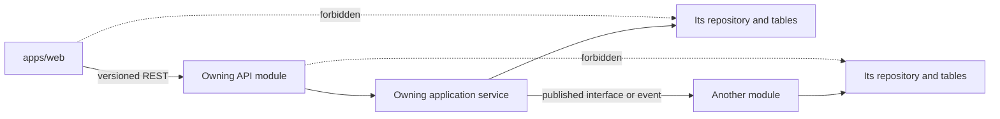

# DevPilot AI Architecture Rules

**Status:** Authoritative implementation rules for AI contributors
**Applies to:** Every feature, refactor, integration, database change, and AI workflow
**Companion documents:** [Project Context](project-context.md), [Development Workflow](workflow.md), [Coding Rules](coding-rules.md), and [Software Architecture](../docs/architecture/architecture.md)

## 1. Purpose and Authority

This document defines how contributors make architectural decisions while implementing DevPilot AI. It is not an architecture overview and does not replace the detailed architecture in `docs/architecture/`.

These rules prevent architectural drift while allowing deliberate evolution. If an implementation request conflicts with these rules, follow these rules unless the architecture documentation is explicitly updated through the project's documentation-first process. If source documents conflict, use the order defined in [Project Context](project-context.md).

Before implementing a feature, review the applicable Vision, Requirements, Architecture, Project Context, Workflow, Coding Rules, story, and existing implementation. Do not introduce a structural change based on a prompt alone.

## 2. Architectural Commitments

Every architectural decision reinforces these commitments:

| Commitment | Implementation consequence |
| --- | --- |
| Documentation First Development | Record material decisions, designs, API changes, and affected documentation before treating work as complete. |
| Story Driven Development | Deliver a complete vertical slice—UI, API, data, authorization, tests, and documentation—as appropriate to the story. |
| Modular Monolith | Keep one deployable application with explicit domain boundaries; do not introduce a microservice without an approved architectural decision. |
| Domain Driven Design | Organize business behavior around product domains and their language, not generic technical layers shared across unrelated features. |
| Feature Driven Development | Build frontend and backend together around a user outcome; do not deliver disconnected frontend-only or backend-only product behavior. |
| Human-guided AI | AI proposes and assists; users remain responsible for material changes, approvals, and delivery decisions. |

## 3. Module Boundaries

A module is a coherent business capability with a distinct purpose, owned data, domain rules, API surface, and tests. Current domains are Authentication, Workspace, Projects, Documentation, Stories, Architecture & Technical Design, GitHub, Knowledge, AI Workspace, Collaboration, Search, Notifications, and Settings & Administration.

### Required module contract

Every module must make the following clear in its code and documentation:

| Concern | Rule |
| --- | --- |
| Purpose | Own one cohesive business capability and its invariants. |
| Data | Own its tables and write paths. It may expose stable identifiers and read models, not writable persistence internals. |
| Public surface | Export intentional application-service interfaces and REST endpoints; keep repositories and database models private. |
| Dependencies | Depend only on published interfaces of other modules and only when needed to serve its responsibility. |
| Authorization | Resolve and enforce workspace/project access before reading or changing protected resources. |
| History | Preserve revisions, state transitions, and traceability required by the product rather than silently overwriting material lifecycle information. |

### Boundary rules

- A module owns behavior and data; it does not become a generic utility bucket for unrelated features.
- A module may read or command another module only through that module's exported application service, REST contract, or published event.
- A module must not import another module's repository, ORM model, migration, or internal implementation.
- Dependencies must flow in one direction for a use case. If two modules need each other's internal services, redesign the interaction around an owner, a published event, or a narrow shared contract.
- Do not create a new module merely for a small feature. Extend the existing module that owns the user outcome and data.

## 4. Data Ownership

Every table belongs to exactly one module. The owning module is the only module allowed to create, update, or delete rows in that table.

| Rule | Required practice |
| --- | --- |
| Single owner | Declare/maintain ownership in the owning module's schema and architecture documentation. |
| Writes | Use the owning module's application service and repository for all mutations. |
| Cross-domain data | Request a command from the owner, consume a published event, or use an approved read projection. |
| Relationships | Store stable identifiers and enforce foreign-key/constraint integrity where appropriate; do not use a foreign key as permission to write another module's record. |
| Tenancy | Scope workspace data by workspace ID and project data by project ID; authorization must match those boundaries. |
| History | Use explicit revisions/history/outcome records for material changes. Do not silently destroy traceability. |

Direct cross-module writes are forbidden, including inside the same Prisma transaction. A transaction may coordinate tables only when they are owned by the same module. If a cross-domain operation requires atomicity, first model a clear owning command; use the transactional outbox for follow-on work where appropriate.

## 5. Module Communication

Use the simplest boundary that preserves ownership and keeps the request reliable.

| Communication mode | Allowed when | Rules |
| --- | --- | --- |
| Internal application-service call | A bounded synchronous use case needs an immediate answer or asks the owning module to perform its own command. | Depend on an exported interface, not a repository or database model. Keep calls narrow and avoid cycles. |
| REST API | The browser calls backend capabilities, or a future independently deployed module needs a public contract. | Use versioned, documented REST contracts; enforce authentication, authorization, validation, and consistent errors. |
| Domain event / outbox | A completed fact should trigger non-blocking work in another module. | Events are past-tense facts, idempotent, versioned when shared, and must not be required for the originating transaction to succeed. |
| Read projection | Search, dashboards, or retrieval need denormalized data. | A projection is not canonical data and must be rebuildable from owning sources. |

### Forbidden communication

- Direct reads or writes of another module's tables, Prisma models, or repositories.
- Circular service imports or bidirectional module dependencies.
- Frontend calls to PostgreSQL, Prisma, Redis, object storage, GitHub, Slack, or an AI provider.
- Treating a shared TypeScript type as permission to reach into another module's implementation.
- Synchronous dependency on notifications, indexing, analytics, or other nonessential background work to complete a user command.

## 6. Knowledge Service and AI Context

Knowledge Service is the only provider of project context to AI. This is a mandatory security and architecture boundary.

| Rule | Requirement |
| --- | --- |
| AI context path | AI Workspace must ask Knowledge Service to assemble context for every AI request. |
| No bypass | AI must never query PostgreSQL, business-module repositories, vector stores, GitHub, Slack, file storage, or other infrastructure directly for project context. |
| No business ownership | Knowledge Service indexes and assembles source information; canonical documents, stories, ADRs, designs, and source activity remain owned by their originating modules. |
| Authorization | Knowledge Service filters context by the actor's effective workspace/project/resource access before returning any source. |
| Traceability | Context packages and AI outputs retain source references, revision/freshness signals, and user-selected inclusions or exclusions. |
| Material changes | AI suggestions are accepted, edited, or discarded by a user. Accepted changes are written through the destination module's service, never by direct AI persistence. |

Knowledge Service may evolve from PostgreSQL-backed retrieval to vector, GitHub, Slack, or file-storage sources. Those sources are implementation details behind its interface and must not change the AI module's dependency direction.

## 7. Shared Packages

Shared packages provide stable reuse across applications. They must not become a way to bypass domain boundaries.

| Package | Owns | Must not contain |
| --- | --- | --- |
| `packages/shared-ui` | Design tokens, accessible reusable UI primitives, and common interaction/layout patterns. | Feature-specific business behavior, API calls, domain authorization, or duplicate design primitives. |
| `packages/shared-types` | Stable API DTOs, value types, shared enums, and common result/pagination/error contracts. | Prisma models, database entities, secrets, framework decorators, repositories, or business services. |
| `packages/config` | Centralized non-secret tool/build configuration. | Environment-specific secrets, business logic, or feature state. |

Before creating a component, hook, utility, type, or configuration item, search for an existing appropriate implementation. Reuse it when it fits. Add to a shared package only when it is genuinely cross-feature/cross-application and has no domain-specific behavior. Otherwise, keep it in the owning feature/module.

## 8. Feature Placement

Choose placement by ownership and reuse, not by convenience.

| Situation | Place it here |
| --- | --- |
| It changes an existing domain's records, rules, or workflow | Extend that owning backend module and the corresponding frontend feature. |
| It is a new cohesive business capability with unique data and rules, not owned by an existing domain | Propose a new module, document its purpose/data/dependencies/public surface, then implement after the boundary is clear. |
| It is a reusable, domain-neutral accessible UI pattern | `packages/shared-ui`. |
| It is a reusable API/value contract used by web and API | `packages/shared-types`. |
| It is used only by one feature/module | Keep it private to that feature/module. |
| It adapts an external provider | The owning integration module behind an adapter/interface; never in frontend code or a generic domain module. |
| It assembles project context for AI or retrieval | Knowledge Service, while source records remain with their owning module. |

New modules require a reason that an existing module cannot own the responsibility coherently. They must state their owned data, public interfaces, dependencies, authorization needs, migration impact, and extraction path in the technical design or ADR when material.

## 9. Frontend Rules

These rules complement, rather than replace, `frontend-rules.md`.

- Keep `apps/web` feature-first: routes and layouts compose features; feature folders own feature-specific screens, client state, forms, and API usage.
- Use pages/routes for navigation and composition, layouts for shared shell/route structure, and `shared-ui` for reusable design-system components.
- Call backend capabilities only through the typed, versioned REST client. UI authorization gates improve experience but never replace server-side authorization.
- Keep business invariants, permission decisions, persistence, provider credentials, and integration orchestration in the backend.
- Represent loading, empty, success, and recoverable error states for user-facing asynchronous actions.
- Do not add a local component library or duplicate a shared UI component to avoid a small integration cost; improve `shared-ui` when reuse is warranted.

## 10. Backend Rules

These rules complement, rather than replace, `backend-rules.md`.

| Layer | Responsibility | Must not do |
| --- | --- | --- |
| Controller | Map validated HTTP input to an authorized use case and map results to HTTP responses. | Contain business rules, direct ORM access, provider logic, or cross-module persistence. |
| Application service | Execute use cases, enforce workflow invariants, coordinate owned repositories, and call published interfaces. | Expose persistence details or reach into another module's internals. |
| Domain policy/service | Encapsulate domain rules that need independent testing or reuse within the module. | Become a generic cross-domain service. |
| Repository | Persist and query the module's own records through Prisma. | Implement HTTP concerns or query another module's tables. |
| DTO/contract mapper | Define and validate API input/output boundary shapes. | Leak Prisma entities or internal domain objects as public API. |

Validate all external input at the API boundary. Apply authentication and authorization before protected operations. Use background jobs for retryable or slow provider work; report job state rather than pretending asynchronous work completed synchronously.

## 11. Database Rules

- PostgreSQL is the transactional system of record; Prisma is its persistence adapter, not the public domain contract.
- Keep schema, migrations, repository logic, and constraints aligned with the owning module.
- Add database constraints and indexes that protect real ownership, lifecycle, authorization-navigation, and query requirements.
- Prefer explicit relation/link records for traceability over unstructured references that cannot be queried or audited.
- Treat archive, deletion, and history separately. Preserve a tombstone or relationship state when removing a source would otherwise break required traceability.
- Store attachment metadata and private object keys in the database; do not store public storage URLs or secrets.
- Plan migrations for compatibility: expand, migrate/backfill, switch reads/writes, then contract only after dependent code is removed.

## 12. API Rules

The web-to-backend boundary is REST only.

| Area | Rule |
| --- | --- |
| Versioning | Prefix public endpoints with `/api/v1`. Prefer additive evolution; coordinate and document breaking changes. |
| Naming | Use resource-oriented, plural nouns and consistent nesting where a workspace/project parent boundary matters. Avoid action names when a resource/state transition expresses the intent. |
| Contracts | Use explicit DTOs from `shared-types` where appropriate. Do not expose Prisma entities or internal errors. |
| Validation | Validate input types, formats, required fields, bounds, and allowed transitions before application logic runs. |
| Authorization | Enforce current workspace, project, and resource access in the API/application layer for every request. |
| Errors | Return stable, meaningful client-safe error responses; log structured diagnostic context without content, tokens, credentials, or secrets. |
| Mutations | Use appropriate HTTP methods, predictable status codes, idempotency for externally retried operations where necessary, and audit material actions. |

## 13. Future Scalability and Evolution

Make code extraction-ready without building distributed systems prematurely.

- Keep applications stateless where possible; store durable business state in PostgreSQL and ephemeral coordination/cache state in Redis.
- Design cross-module interactions around interfaces and outbox-ready domain events so an in-process consumer can later become an external one.
- Keep external integrations behind provider adapters with scoped credentials, source metadata, retries, and failure isolation.
- Keep AI provider/model orchestration behind AI Workspace and context retrieval behind Knowledge Service.
- Add a vector store, search engine, job worker capacity, message broker, or microservice only after an observed requirement and an approved technical design/ADR justify it.
- When extracting a module, move its owned data with it. Do not retain shared-table writes or use the old database as a permanent integration API.

## 14. Forbidden Practices

The following are architectural anti-patterns and must not be introduced:

- Business logic, authorization decisions, or ORM calls in controllers.
- Duplicate feature logic, UI primitives, API contracts, or utilities when an existing suitable implementation can be reused.
- Circular module dependencies or a generic shared service that accumulates unrelated domain behavior.
- Direct access to another module's tables, Prisma models, repositories, or migrations.
- AI context retrieval that bypasses Knowledge Service.
- Frontend access to databases, infrastructure, provider credentials, or external service APIs.
- Hardcoded configuration, environment values, secrets, roles, or endpoints that belong in configuration or domain data.
- Unvalidated external input, unscoped database queries, silent error swallowing, or logging sensitive project data.
- Exposing persistence entities as REST contracts.
- Treating an asynchronous job as a completed user action before its actual result is known.
- Introducing microservices, a message broker, a vector database, or autonomous AI actions without an approved architectural decision and validated need.

## 15. Architectural Decision Process

Before writing code, answer these questions in the story plan or technical design:

1. Which existing module owns this feature and why?
2. Which module owns each new or changed record/table?
3. Does a similar feature, component, service, type, or utility already exist?
4. Can existing `shared-ui` components and `shared-types` contracts be reused safely?
5. What frontend route/feature, REST endpoint, application service, validation, authorization policy, and persistence change are required for the complete slice?
6. Does the change cross a module boundary? If so, is the interaction an exported interface, REST contract, event, or read projection?
7. If AI is involved, does all project context come exclusively from Knowledge Service and are sources/permissions preserved?
8. What lifecycle history, traceability links, audit records, tests, and documentation updates are required?
9. Does the change introduce a material platform, data, security, integration, or long-lived workflow decision that requires an ADR?

### Escalate instead of guessing

Stop and request clarification or an explicit design decision when requirements conflict, ownership is unclear, a new cross-domain data model is needed, permissions/security behavior changes, a breaking API/migration is required, or an implementation would violate these rules. Prefer a small documented decision over a convenient architectural exception.

## 16. Final Rule

Implement the smallest complete change that satisfies the documented story while preserving module ownership, traceability, authorization, and future evolution. Architecture is successful when the next contributor can understand where a capability belongs, why it belongs there, and how it may evolve without bypassing the system's boundaries.
