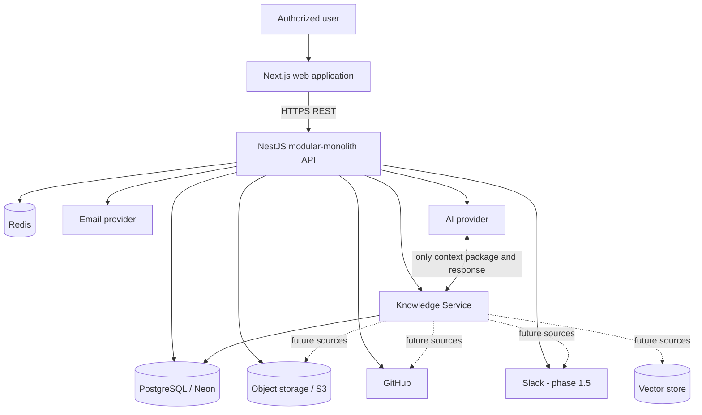
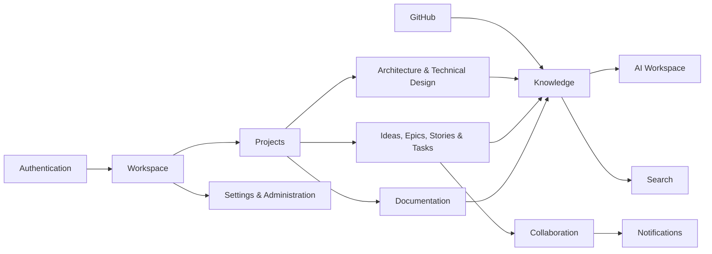
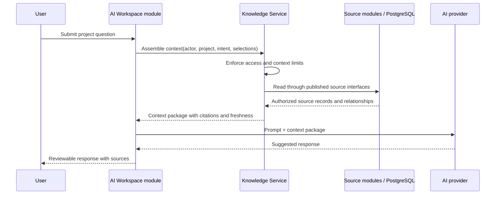
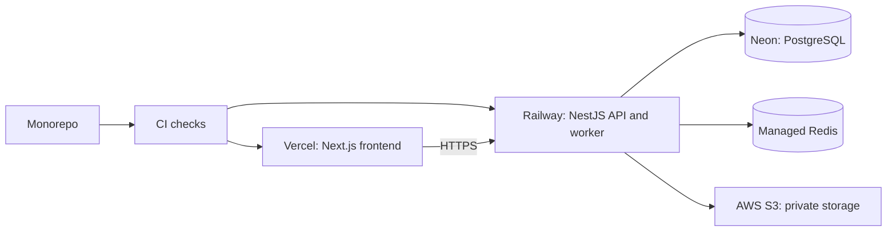

# DevPilot AI Software Architecture Document

**Status:** Proposed baseline  
**Audience:** Engineering, product, and future contributors  
**Source of truth:** [Product Vision](../product/vision.md), [Product Requirements](../product/requirements.md), and [Product Roadmap](../product/roadmap.md)  
**Last updated:** 2026-07-14

## 1. Introduction

This document defines the target software architecture for DevPilot AI. It is the engineering blueprint for delivering the approved product: a shared, AI-assisted software-engineering workspace that preserves project context across the lifecycle of a change.

DevPilot AI is not an IDE and does not replace GitHub or a team's existing editor. It provides the workspace in which teams manage project knowledge, story-driven work, technical decisions, linked source activity, validation, and delivery records. AI is a human-guided assistant that operates on authorized, assembled project context.

The initial system is a modular monolith. It is intentionally optimized for a two-developer team to deliver complete vertical slices quickly, while retaining clear domain boundaries that make future extraction possible without redesigning the product model.

### Scope and constraints

- The approved Vision and Product Requirements define product behavior. This document defines how that behavior is organized and delivered; it does not add product scope.
- The frontend, backend, and database remain separate concerns. The frontend reaches business capabilities only through versioned REST APIs.
- Each business capability owns its data and exposes controlled application interfaces. No module writes another module's tables.
- The MVP prioritizes the connected journey of project setup, source-of-truth knowledge, story definition, context-aware AI assistance, and GitHub activity linkage.
- Human users retain approval of material decisions, AI outputs, reviews, validation, and deployment status.

## 2. Architecture Goals

| Goal | Architectural response |
| --- | --- |
| Preserve connected project knowledge | Model durable records and explicit relationships across requirements, work, design, source activity, validation, and delivery. |
| Deliver safely with a small team | Use a modular monolith, one primary relational database, shared packages, automated checks, and vertical-slice stories. |
| Keep AI context-aware and permission-safe | Route every AI request through the Knowledge Service, which assembles only authorized context and records its sources. |
| Support small teams without process overhead | Use a constrained role model, explicit workflow states, and configurable standards rather than a general workflow engine. |
| Maintain future optionality | Enforce module ownership, stable REST contracts, service interfaces, outbox-ready events, and integration adapters. |
| Protect sensitive engineering data | Apply authentication, workspace and project authorization, audit logging, secret isolation, and least-privilege integration access. |
| Provide reliable traceability | Keep immutable history where required and explicit links for the lifecycle: requirement → epic → story → technical design → implementation → review → testing → deployment → release notes. |

### Quality attributes

The architecture prioritizes correctness of access boundaries and traceability over premature distributed scale. Common workspace, project, story, and document operations must remain responsive; long-running integration, indexing, and AI work must report progress and actionable failure states. The system must be observable without exposing content or secrets in telemetry.

## 3. Architecture Principles

1. **Modular monolith first.** Deploy the API as one NestJS application and organize it into independently testable domain modules. Network boundaries are introduced only when measured operational or scaling needs justify them.
2. **Domain-driven organization.** Code, tables, APIs, authorization policies, and tests are grouped by business capability, not by generic controller/service/repository layers across the whole application.
3. **Data ownership is strict.** A module may query only its own persistence models directly. Cross-domain use occurs through an application service interface, REST endpoint, or published domain event.
4. **REST is the web boundary.** Next.js uses documented REST APIs; it does not access PostgreSQL, Prisma, integrations, or AI providers.
5. **Feature slices are complete.** Each story includes the API, frontend, authorization, persistence, tests, documentation, and observability needed for a usable outcome.
6. **Documentation first.** Requirements, technical design, ADRs, and acceptance criteria precede implementation. Changes update affected documentation before completion.
7. **Shared UI and types.** Reusable interaction patterns belong in `packages/shared-ui`; transport contracts and shared value types belong in `packages/shared-types`. Domain behavior does not move into either package.
8. **Context before generation.** The AI layer neither queries PostgreSQL nor calls infrastructure integrations. It receives an authorization-filtered context package from the Knowledge Service.
9. **Human-controlled automation.** AI and automation propose, summarize, or notify; they do not silently create material project changes, approve work, or release software.
10. **Design for extraction, not distribution.** Interfaces, ownership boundaries, and idempotent events make extraction possible later without paying microservice complexity in MVP.

## 4. System Overview

DevPilot AI consists of a browser application, a REST API, a PostgreSQL system of record, object storage for files, and controlled adapters for external services. Redis supports ephemeral concerns such as rate limiting, short-lived caching, background job coordination, and refresh-token/session controls where needed.



The final arrow is a logical boundary: the AI orchestration module obtains an approved context package from Knowledge Service and sends it to the AI provider. The AI provider has no database credentials, direct integration credentials, or infrastructure access.

## 5. High-Level Architecture

### Runtime boundaries

| Layer | Responsibility | Must not do |
| --- | --- | --- |
| `apps/web` | Rendering, client navigation, accessible interaction, API client behavior, presentation-only state. | Read databases, enforce authoritative permission decisions, call providers directly, or duplicate business rules. |
| REST API | Authentication, authorization, domain commands and queries, workflow rules, integration orchestration, audit events. | Allow cross-module table writes or expose internal persistence schemas as its contract. |
| PostgreSQL | Transactional source of record, relationships, history, and data constraints. | Become a shared, ungoverned access layer across modules. |
| Redis | Ephemeral cache, distributed rate limits, job coordination, and short-lived state. | Hold authoritative project records or durable audit history. |
| Object storage | Private document attachments and generated exports where applicable. | Grant public access or decide authorization without the API. |
| External adapters | Translate GitHub, Slack, email, MCP, and AI-provider protocols into internal commands/events. | Leak external models into core domain records. |

### Request and asynchronous processing

Synchronous REST requests handle user-visible reads and short validation/command work. Operations that may be slow, retryable, or externally dependent—webhook processing, repository synchronization, notification delivery, indexing, and AI generation—run as background jobs. A job stores progress and failure state so the UI can show an accurate outcome.

The monolith initially hosts the worker process using the same codebase and domain interfaces. It may run as a separate process from the API for reliability, but it is not a separate business service.

## 6. Domain Architecture

### Domain map



Dependencies indicate allowed use of published interfaces, not access to another module's tables. The Projects module provides the project boundary; all project-scoped module APIs begin by resolving workspace, project, actor, and effective permission.

### Module responsibilities and boundaries

| Module | Purpose and responsibilities | Owned data | Depends on | Public API surface | Future extraction strategy |
| --- | --- | --- | --- | --- | --- |
| Authentication | Account lifecycle, credentials, sessions, password recovery, identity claims. | users, credentials/provider identities, sessions, refresh-token records, recovery tokens. | None. | `/auth/*`, `/me` | Extract only if identity scale, enterprise SSO, or shared identity requires it; issue stable signed identity claims. |
| Workspace | Workspace lifecycle, membership, invitations, workspace roles and standards boundary. | workspaces, memberships, invitations, workspace roles, workspace standards references. | Authentication, Notifications. | `/workspaces`, `/workspaces/{id}/members`, `/invitations` | Publish membership and role events; move with authorization-policy service only when independently needed. |
| Projects | Project lifecycle, membership override, status, project purpose and project boundary. | projects, project memberships, project settings, archive state. | Workspace. | `/workspaces/{id}/projects`, `/projects/{id}` | Extract after project throughput or isolation needs justify it; retain project ID as the tenancy key. |
| Documentation | Living product and technical documents, revision history, ownership, status, attachments, source-of-truth designation. | documents, document revisions, document relationships, attachments metadata. | Projects, Authorization, Storage. | `/projects/{id}/documents`, `/documents/{id}`, revision and relationship endpoints | Extract with storage adapter and document revision stream if document editing/search load becomes independent. |
| Stories | Ideas, epics, stories, tasks, dependencies, assignments, acceptance criteria, workflow history, and traceability anchors. | ideas, epics, stories, tasks, dependencies, assignments, acceptance criteria, status histories, work links. | Projects, Workspace, Documentation/Architecture interfaces. | `/projects/{id}/ideas`, `/epics`, `/stories`, `/tasks` | Most likely early extraction candidate; publish story lifecycle events and keep IDs stable. |
| Architecture & Technical Design | Architecture records, technical designs, ADRs, decisions, design review state, and links to impacted work. | architecture records, technical designs, ADRs, decision revisions, design relationships. | Projects, Documentation, Stories. | `/projects/{id}/architecture`, `/technical-designs`, `/adrs` | Extract with document-link contract if design governance becomes a separately scaled capability. |
| GitHub | Repository connections, OAuth/app installation references, webhook verification, synchronized metadata, and story links. | repository connections, encrypted credential references, webhook deliveries, source-activity metadata, story-source links. | Projects, Stories, Notifications. | `/projects/{id}/github/*`, webhooks, repository/activity link endpoints | Natural integration service candidate; retain a provider-neutral source-activity model. |
| Knowledge | Indexes authorized project knowledge, resolves relationships/freshness, assembles project and AI context. It owns no source business records. | index entries, retrieval metadata, context assembly/audit records, source freshness markers. | Read interfaces from Documentation, Stories, Architecture, GitHub, Projects and authorization. | Internal `KnowledgeService`; `/projects/{id}/knowledge/context` only for permitted human inspection. | Extract when retrieval infrastructure or indexing load needs independent scaling; preserve source references and authorization contract. |
| AI Workspace | Human-initiated, source-linked AI requests, role-specific prompts, response status, and explicit accepted-output workflow. | AI requests, context references, generated outputs, acceptance/discard history, provider usage metadata. | Knowledge, Projects, Stories, Documentation, Architecture. | `/projects/{id}/ai/requests`, `/ai/requests/{id}`, accept/discard endpoints | Extract after provider traffic, model routing, or asynchronous workloads require it; it continues to call Knowledge only. |
| Collaboration | Comments, mentions, review requests, review decisions, and activity feed. | comments, mentions, review requests/outcomes, activity events. | Authentication, Projects, Stories, Documentation, Architecture. | `/comments`, `/reviews`, `/activity` | Extract with event-driven notifications once collaboration volume warrants it. |
| Search | Access-aware search queries and result projections over indexed content. | Search projections/index state; no canonical content. | Knowledge, Authorization. | `/search`, `/projects/{id}/search` | Extract alongside a dedicated search engine when relational search is no longer sufficient. |
| Notifications | In-product and external delivery preferences, delivery records, deduplication, and retries. | preferences, notification records, delivery attempts, idempotency keys. | Workspace, Collaboration, Stories, GitHub, Email/Slack adapters. | `/notifications`, `/notification-preferences` | Extract as a worker/service when channel volume or retry policies become operationally distinct. |
| Settings & Administration | Workspace governance, access settings, integration configuration, retention preferences, and later aggregate analytics. | settings, retention policies, integration configuration references, aggregate metrics definitions. | Workspace, Authorization, Integration modules. | `/workspaces/{id}/settings`, `/projects/{id}/settings` | Keep administrative policy close to Workspace until a validated organization-management need exists. |

### Cross-cutting authorization policy

Authorization is centralized as an application capability, not duplicated in controllers. Every command and query resolves an `AccessContext` containing authenticated user, workspace membership, project membership restrictions, role, and requested resource. Modules use policy checks such as `canReadProject`, `canManageMembers`, `canEditStory`, and `canUseAi` before reading source material or performing a mutation.

The effective permission is the intersection of workspace role, project-level restriction, and resource-specific sharing. The system returns a clear forbidden/not-found-safe response without revealing restricted resource metadata.

## 7. Frontend Architecture

`apps/web` uses Next.js, React, and TypeScript. It is feature-first so a feature has its route components, view models, API hooks, form validation, and tests near one another. Reusable primitives and patterns must come from `packages/shared-ui`.

```text
apps/web/src/
  app/                    # routes, layouts, route guards
  features/
    stories/
    documentation/
    projects/
    ai-workspace/
    ...
  lib/api/                # typed REST client, auth/session handling
  lib/access/              # navigation and presentation gating only
  components/              # composition specific to web app, not design primitives
```

### Frontend rules

- The UI consumes generated or maintained shared REST contract types from `packages/shared-types`; it does not import API implementation code or Prisma types.
- RBAC controls navigation and presentation to improve usability, but API authorization is always authoritative.
- Owner, Admin, Developer, Reviewer, and Guest dashboards are role-appropriate views of the same authorized records. They do not imply separate data stores or permission bypasses.
- Mutations show pending, success, and recoverable failure states. Long-running AI and sync jobs expose progress through API resources or polling; no UI assumes a request has completed merely because it was submitted.
- Core workflows meet keyboard, focus, labels, contrast, and assistive-technology requirements. Shared UI is the enforcement point for these rules.
- Feature implementation accompanies the corresponding REST endpoint, tests, and documentation update in the same story.

## 8. Backend Architecture

`apps/api` is a NestJS modular monolith using feature modules. Each module contains its controller(s), application services/use cases, domain policies, repositories, DTO mapping, and tests. Prisma is the persistence adapter, not the domain model.

```text
apps/api/src/
  modules/
    stories/
      api/ application/ domain/ infrastructure/
    documentation/
    knowledge/
    ...
  platform/
    auth/ authorization/ database/ jobs/ observability/ storage/
```

### API standards

- REST endpoints use plural resources, explicit nesting where a parent boundary matters, and a version prefix such as `/api/v1`.
- Controllers validate input, obtain `AccessContext`, call an application use case, and map result/error responses. They do not contain workflow logic or direct Prisma calls.
- Application services enforce invariants, coordinate owned repositories, and call other modules only through explicit exported interfaces.
- Domain events capture meaningful completed facts, for example `StoryReadyForDevelopment`, `DocumentRevised`, `DecisionSuperseded`, and `SourceActivityLinked`. Events are not commands and do not allow a receiver to mutate the publisher's data.
- A transactional outbox records publishable events with the source mutation. An in-process dispatcher may consume them initially; a future broker can consume the same outbox without changing domain code.
- All externally initiated calls and webhooks are authenticated, validated, idempotent, rate-limited where appropriate, and audited when material.

### Lifecycle integrity

Story state transitions are explicit and append a status-history record. Readiness and completion checks use the project's visible Definition of Done and configured required context. A story cannot be represented as successfully delivered unless its applicable acceptance criteria and validation outcome are visible; approved exceptions are durable records, never silent bypasses.

## 9. Database Architecture

PostgreSQL is the transactional source of truth, accessed through Prisma. It uses a single database initially, with tables logically grouped by module ownership. A module's repository is the only code allowed to write its tables.

### Ownership and tenancy

| Ownership area | Examples | Boundary rule |
| --- | --- | --- |
| Identity | users, sessions, recovery records | User identity is global; all workspace data references a user ID only. |
| Workspace | workspaces, memberships, invitations, workspace settings | Workspace ID is the primary tenancy boundary. |
| Project | projects, project memberships, project settings | Project belongs to exactly one workspace; project-scoped records carry project ID. |
| Work | ideas, epics, stories, tasks, criteria, dependencies, histories | Work belongs to one project and links outward by stable IDs. |
| Knowledge sources | documents/revisions, designs, ADRs, repository metadata | Canonical source remains in its owning module; indexes store references and denormalized retrieval fields only. |
| Lifecycle records | comments, reviews, test outcomes, deployments, release notes | Each record links to its story/project and preserves outcome history. |
| Platform support | audit logs, outbox events, jobs, notification delivery | These are append-oriented and never replace source-of-truth business records. |

All project-scoped tables include a project ID; workspace-scoped records include a workspace ID. Foreign keys, unique constraints, check constraints, and transactional writes enforce ownership and lifecycle integrity. Indexes begin with common authorization and navigation paths such as `(workspace_id, id)`, `(project_id, status)`, `(story_id, created_at)`, and full-text/index projection keys as search requires.

### Data history and deletion

- Revisions, decisions, story status changes, review outcomes, validation results, deployment outcomes, and audit records are append-only or versioned.
- Archive is distinct from deletion. Archived projects and content remain readable only according to authorization and retention policy.
- Referential deletion is deliberate: source deletion must preserve an explanatory tombstone or relationship state when traceability would otherwise be lost.
- Attachments reside in private object storage; PostgreSQL stores metadata, ownership, checksum, and object key—not public URLs.
- Integration tokens and secrets are encrypted at rest and stored as references or encrypted values separated from ordinary domain records.

## 10. Knowledge Service

Knowledge Service is a core logical component, initially implemented as the `knowledge` module inside the monolith. It does not own or alter business data. Its responsibility is to make authorized, relevant project context available consistently to search and AI.

### Responsibilities

- Index document, story, requirement, ADR, architecture/design, and GitHub metadata references.
- Resolve relationships such as a story's requirements, technical design, linked decisions, source activity, and validation state.
- Track source, owner, status, revision/freshness, and authorization scope for every retrieval item.
- Assemble a bounded context package for a human query or AI request.
- Return source references and exclusion reasons without exposing restricted material.



The context package contains only the minimum relevant content, source identifiers, titles, revisions, freshness signals, and permission-safe excerpts required for the request. AI request records retain which sources were used and any user-selected exclusions. The service may ask the caller to obtain clarification when sufficient context is unavailable or conflicting.

Initially, indexing and retrieval use PostgreSQL queries and access-aware projections. Vector search, GitHub/Slack retrieval, file extraction, or a dedicated retrieval store can later be added behind Knowledge Service source adapters. The AI interface must remain unchanged by those additions.

## 11. AI Architecture

AI Workspace is a contextual engineering-assistance capability, not an autonomous agent platform and not an IDE. Supported assistance maps to the approved roles: business analysis, architecture, development planning, quality/review, documentation, and delivery advice.

### Request lifecycle

1. An authorized user chooses an AI capability and visible project sources, or asks a project question.
2. AI Workspace validates the request and asks Knowledge Service to assemble authorized context.
3. Knowledge Service returns source-linked context or a clear insufficiency/conflict result.
4. AI Workspace invokes the selected provider through a provider adapter, with request-level timeouts, usage limits, and redacted operational logging.
5. The response is persisted as a suggestion with its source context, model/provider metadata, and status.
6. The user explicitly accepts, edits, or discards material output. Acceptance creates or revises the relevant record through that record's owning module; it is never a direct AI write.

### Guardrails

- The provider receives context only from Knowledge Service, never database or integration credentials.
- Authorization is evaluated before context assembly and preserved in every retrieval call.
- Responses present their source context, known freshness, and limitations. They do not claim unverified project facts as authoritative.
- Prompts and outputs are treated as project data for access, retention, and audit purposes. Sensitive content is not placed in application logs.
- AI cannot approve reviews, change roles, connect integrations, alter deployment status, or execute delivery actions.
- Model/provider selection is hidden behind an adapter so provider changes do not change domain workflows.

## 12. MCP Integration

Model Context Protocol support is an integration boundary, not a replacement for domain APIs or authorization. Each external capability is represented by an independent MCP server or adapter with its own credential scope, tool definitions, availability checks, and audit trail.

| MCP capability | Initial/future role | Boundary |
| --- | --- | --- |
| GitHub MCP | Repository/activity lookup and controlled source metadata operations. | Uses only the connected project's granted installation/token scope. |
| Slack MCP | Future notification and permitted context retrieval. | Enabled only after workspace/project access can be mapped safely. |
| Search MCP | Future retrieval access through Knowledge Service. | Returns permission-filtered, cited results; no raw database access. |
| Database MCP | Development/operations only if ever enabled. | Never available to production AI workflows or end users. |
| Filesystem MCP | Development workspace tooling only. | Never receives production project storage credentials by default. |

MCP tools invoke adapters or published module interfaces; they never bypass the Knowledge Service for AI context and never write another module's data directly. New integrations follow the same adapter contract: authorization mapping, least-privilege credentials, source/freshness metadata, idempotency, auditability, and failure isolation.

## 13. Authentication & RBAC

The API uses short-lived JWT access tokens and securely managed refresh tokens. Password recovery, invitation acceptance, session revocation, rate limiting, and duplicate-account handling are part of the Authentication module. Token claims identify the user; permissions are evaluated against current membership and project restrictions rather than trusted indefinitely from token claims.

| Role | Architectural authorization scope |
| --- | --- |
| Owner | Full workspace control, ownership actions, and owner-only account decisions. |
| Admin | Members, projects, standards, integrations, settings, and reporting; excludes owner-only actions. |
| Developer | Authorized project content and work creation/update, AI requests, and delivery records; no workspace-role administration. |
| Reviewer | Read authorized context and record assigned review decisions/comments; no workspace administration. |
| Guest | Explicitly shared project/content read access and permitted comments only. |

Project-level restrictions can narrow workspace permissions. Effective access is exposed in the UI for clarity, but evaluated server-side for every resource. Material security events—including membership/role changes, invitation lifecycle, integration connections, access denials of administrative actions, and ownership changes—produce audit records with actor, target, timestamp, outcome, and request correlation ID.

## 14. Module Communication

### Allowed communication modes

| Mode | Use | Example |
| --- | --- | --- |
| Synchronous exported service interface | A command/query needs an immediate, bounded answer from another module. | Stories asks Projects to validate project state and membership. |
| REST API | Browser-to-backend and later service-to-service public contracts. | Web loads `/api/v1/projects/{id}/stories`. |
| Domain event / outbox | A completed fact triggers asynchronous, non-blocking work. | `DocumentRevised` requests re-indexing and stale-link analysis. |
| Read projection | Search/dashboard needs a denormalized, refreshable view. | Search projection includes story title, status, source, freshness. |

### Prohibited communication

- Importing another module's repository or Prisma model.
- Updating another module's table, even inside a shared database transaction.
- Calling GitHub, Slack, AI, or storage providers from frontend code.
- Sending raw project data to an AI provider without a Knowledge Service context package.
- Making workflow completion depend on a nonessential notification, indexing, or analytics job.

For a cross-domain command, the owning module performs its own mutation after receiving an explicit request or reacts to an event. The initiating response must accurately state whether the work is complete or pending asynchronous processing.

## 15. Shared Packages

```text
packages/
  shared-ui/       # design tokens, accessible components, layout and interaction patterns
  shared-types/    # API contracts, DTO/value types, shared enums without business behavior
  config/          # centralized tool configuration
  eslint-config/   # lint rules
  tsconfig/        # TypeScript bases
```

`shared-ui` is the only home for reusable design-system components. Feature modules compose these components; they must not fork button, form, dialog, status, or accessibility behavior. `shared-types` contains stable contracts used by frontend and backend, including pagination/error envelopes and resource DTOs. It must not expose Prisma-generated types, database entities, secrets, NestJS decorators, or domain services.

API contract changes are reviewed as compatibility changes. Additive changes are preferred; breaking changes require a versioning/migration plan and coordinated frontend rollout.

## 16. Deployment Architecture

The monorepo deploys independently versioned web and API artifacts from the same reviewed commit.



| Component | Initial deployment responsibility |
| --- | --- |
| `apps/web` | Vercel serves the Next.js application, with environment-specific API base URL and security headers. |
| `apps/api` | Railway runs stateless NestJS API instances. A separate worker process may run the same codebase for jobs. |
| PostgreSQL | Neon provides managed PostgreSQL, backups, encrypted transport, connection limits, and environment isolation. |
| Redis | Managed Redis provides rate limits, cache, and job coordination; losing it must not lose business records. |
| Object storage | Private S3 bucket with encryption, lifecycle policy, and API-issued short-lived access URLs. |

Production, staging, and local environments use separate credentials and data stores. Secrets are stored in each platform's managed secret facility, never in the repository, browser bundle, client logs, or shared TypeScript packages. Database migrations run as a controlled release step before application code that requires them is activated, with backward-compatible expand/migrate/contract sequencing where possible.

## 17. CI/CD Strategy

Every pull request is tied to a story and includes the relevant requirement, technical design or ADR impact, test evidence, and documentation updates. CI validates changed packages and affected applications before merge.

| Stage | Required checks |
| --- | --- |
| Validate | Install with locked dependencies; formatting, linting, TypeScript checks, and package-boundary checks. |
| Test | Unit tests for domain rules, integration tests for repositories/API authorization, and focused end-to-end tests for changed vertical slices. |
| Security | Dependency and secret scanning; verify no environment files or credentials are committed. |
| Build | Build web and API artifacts and verify database migration validity. |
| Deploy preview | Deploy frontend/API staging or preview environment when supported; run smoke tests against authenticated critical paths. |
| Release | Approved merge deploys through staging to production with migration, health check, rollback plan, and release notes linked to stories. |

Production deployment is a human-approved operation. Rollback restores application behavior while preserving traceable deployment records; destructive schema rollback is avoided unless explicitly planned and safe. CI/CD status can later be linked through the GitHub integration, but the product does not automate releases in MVP.

## 18. Scalability Strategy

The architecture scales by preserving stateless application nodes and separating workload types before splitting business domains.

1. **MVP:** one API deployment, one relational database, PostgreSQL-backed retrieval, Redis for ephemeral workload support, and background worker execution.
2. **Growth:** scale web/API horizontally; tune PostgreSQL indexes and connection pooling; move expensive indexing, sync, notification, and AI operations to dedicated worker capacity; add read/search projections.
3. **Retrieval expansion:** add vector retrieval or a dedicated search engine behind Knowledge Service while retaining canonical records in their owning modules.
4. **Event-driven evolution:** move outbox dispatch to a broker when retry volume, fan-out, or independent consumers demand it. Event schemas remain versioned and idempotent.
5. **Selective extraction:** extract only a module with independent load, deploy cadence, operational risk, and stable contracts—likely GitHub integration, AI orchestration, Knowledge/Search, or Notifications. The database moves with the extracted module; shared-table access is never retained.

Scaling decisions use observed measures: request latency/error rate, queue depth/age, database utilization, search latency, AI request duration/failure rate, integration webhook backlog, and workspace/project growth. No microservice is introduced solely in anticipation of scale.

## 19. Security Architecture

| Concern | Controls |
| --- | --- |
| Transport and browser security | TLS everywhere, strict CORS allowlist, Helmet/security headers, CSRF protections appropriate to token transport, secure cookie settings where cookies are used. |
| Authentication | Password hashing, short-lived access JWTs, refresh-token rotation/revocation, recovery-token expiry, session/device visibility where introduced. |
| Authorization | Central policies, workspace and project scoping on every query/mutation, least privilege, server-authoritative checks. |
| API protection | Input validation, parameterized Prisma access, per-identity/IP rate limits, payload limits, webhook signature validation, idempotency keys. |
| Data protection | Encryption in transit and at rest, private object storage, environment-separated databases, minimal PII, retention/deletion procedures. |
| Secrets | Managed secret stores, encrypted integration tokens, scoped GitHub installations/tokens, rotation process, no secret logging. |
| AI safety and privacy | Knowledge-mediated context, visible selected sources, access-aware retrieval, provider isolation, redacted telemetry, human acceptance. |
| Audit and observability | Immutable audit records for material actions; correlation IDs; structured logs and metrics scrubbed of content, credentials, and tokens. |
| Dependency and supply chain | Locked dependencies, automated vulnerability scanning, reviewed updates, protected branches, CI secret scanning. |

Security incidents and access changes must be diagnosable without making sensitive project content broadly visible to operators. Logging captures identifiers, event types, and outcomes rather than document bodies, prompts, tokens, or source code.

## 20. Architecture Decision Records (ADR)

ADRs are stored in `docs/adr/` and are required when a decision changes a significant boundary, platform, persistence approach, security posture, integration contract, or long-lived workflow rule. An ADR includes context, decision, alternatives, consequences, owner, status, and links to affected stories/designs.

The baseline decisions established by this document should be recorded as individual ADRs before implementation begins:

| Proposed ADR | Decision |
| --- | --- |
| Modular monolith | Start with NestJS feature modules and strict ownership rather than microservices. |
| API contract | Use versioned REST between Next.js and NestJS. |
| Data platform | Use PostgreSQL with Prisma as the transactional system of record. |
| Knowledge boundary | Make Knowledge Service the only AI-context assembly route; it owns no business data. |
| AI safety boundary | AI receives no direct database, infrastructure, or integration credentials and cannot make material changes autonomously. |
| Shared packages | Use `shared-ui` for design system and `shared-types` for stable cross-application contracts. |
| Integration model | Use provider adapters/MCP boundaries plus an outbox-ready event model. |
| Deployment baseline | Use Vercel, Railway, Neon, and private S3 with environment isolation. |

This architecture document is not a substitute for an ADR. When an implementation decision materially narrows or changes it, the team adds or supersedes an ADR and updates this document if the system-level blueprint changes.

## 21. Future Evolution

The following evolution paths are intentionally enabled but not pre-built:

- **Collaboration and delivery confidence (Phase 2):** add notification channels, structured review, validation, deployment and release records as modules linked through story traceability.
- **AI and project intelligence expansion (Phase 3):** introduce specialized AI collaborators and richer retrieval sources behind unchanged Knowledge Service and AI interfaces.
- **Search/retrieval scale:** add vector or dedicated search infrastructure only after PostgreSQL-based authorized retrieval is insufficient.
- **Integration expansion:** add Slack, testing, deployment, design, or issue-tracking adapters via the same permission-aware MCP/provider boundary.
- **Event infrastructure:** replace in-process outbox consumers with a broker when operational evidence supports it.
- **Selective service extraction:** separate a module only with owned data, published contracts, independent operational need, and a migration plan that preserves traceability and authorization.
- **Production hardening (Phase 4):** add measured reliability, accessibility, monitoring, incident-response, retention, governance, billing, and analytics improvements after repeat adoption validates the need.

The following remain out of scope unless product requirements change: an IDE, autonomous delivery actions, broad enterprise workflow customization, direct AI infrastructure access, and a general-purpose communication platform.

## 22. Conclusion

DevPilot AI begins as a disciplined modular monolith that makes the project and story—not a tool integration or an AI conversation—the durable center of engineering work. Clear ownership boundaries, REST contracts, source-linked knowledge retrieval, human-controlled AI, and explicit lifecycle records allow a two-developer team to ship complete features now while retaining a credible path to scale and selective service extraction later.

The implementation standard is a complete, permission-safe vertical slice: a user can understand why work exists, access the approved context, perform the authorized action, see its traceable outcome, and retain that knowledge for the next change.
