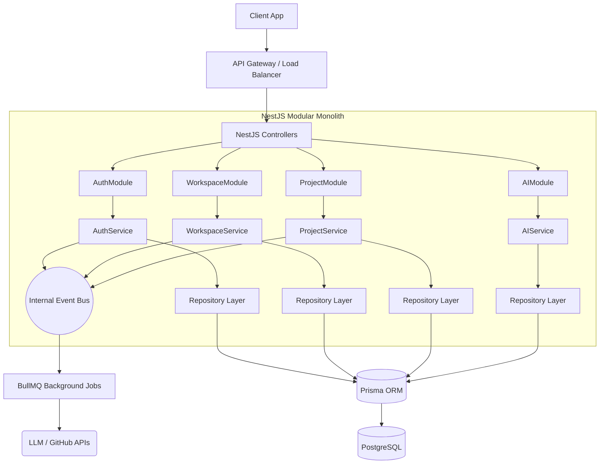
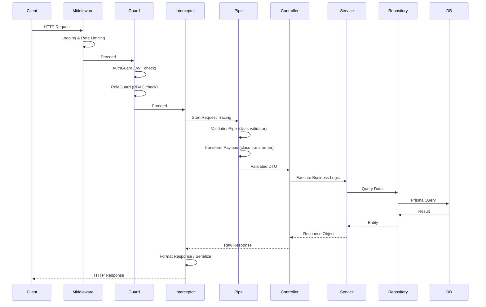

# DevPilot AI - Backend Design Document

## 1. Introduction

### Purpose
This document defines the official Backend Architecture & Design Blueprint for the DevPilot AI platform. It serves as the primary technical specification for backend engineers, dictating application structure, request lifecycles, security patterns, data access strategies, and coding conventions.

### Scope
This design covers the server-side Node.js application built with NestJS, which resides in `apps/api` within the DevPilot AI Monorepo. It outlines the technology stack usage, module organization, event-driven communication, integration architecture, and backend engineering standards. It strictly excludes frontend architecture and detailed business logic implementation.

### Audience
Principal Backend Architects, Backend Developers, DevOps Engineers, and Security Engineers.

### References
- `Requirement.md`
- `HLD.md`
- `database-design.md`
- `api-design.md`
- `development-roadmap.md`

---

## 2. Backend Goals

- **Scalability:** The architecture must handle a growing number of tenants and AI-driven background tasks without degrading latency.
- **Maintainability:** Utilizing NestJS's strict modularity to ensure code remains discoverable and refactorable.
- **Reliability:** Graceful error handling, retry mechanisms for external API calls, and transaction management to ensure data integrity.
- **Security:** Security-first design, enforcing workspace-level Tenant Isolation, JWT validation, and input sanitization by default.
- **Performance:** Optimized database queries via Prisma, connection pooling, and efficient payload transformation.
- **Modularity:** High cohesion within modules and low coupling between them, allowing future extraction into microservices if required.
- **Testability:** Widespread use of Dependency Injection (DI) to allow trivial mocking for unit and integration tests.
- **Developer Experience:** Strong typing via TypeScript, auto-generated Swagger documentation, and unified configuration management.

---

## 3. Backend Architecture

### Monorepo Architecture
- DevPilot AI follows a Monorepo architecture.
- Frontend and Backend are developed in the same repository.
- Shared packages are reused by both applications.
- Documentation is stored inside the `/docs` directory.
- Shared types reduce API contract mismatches.
- Shared configuration ensures consistency across applications.

DevPilot AI implements a **Modular Monolith** pattern using a **Layered Architecture** approach.

- **Modular Monolith:** All backend domains (Auth, Projects, AI) run within a single Node.js process but are strictly partitioned into isolated modules.
- **Layered Architecture:** Each module enforces strict separation of concerns:
  - *Transport Layer (Controllers):* Handles HTTP requests, extracts payloads.
  - *Business Layer (Services):* Executes core business logic.
  - *Data Access Layer (Repositories):* Abstracts database operations via Prisma.
- **Dependency Rules:** Modules may only communicate via public Services or Domain Events. Direct access to another module's Repository or Prisma models is strictly forbidden.

### Architecture Diagram



---

## 4. Backend Folder Structure

The backend application is located at `apps/api/src/` within the DevPilot AI Monorepo.

```text
apps/
└── api/
    └── src/
        ├── common/               # Global guards, filters, interceptors, and decorators
        ├── config/               # Configuration files and environment variables validation
        ├── modules/              # Core business domains (The Modular Monolith)
        │   ├── auth/
        │   ├── workspaces/
        │   ├── projects/
        │   └── stories/
        ├── shared/               # Code shared across multiple modules (e.g., PrismaService)
        ├── infrastructure/       # External infrastructure adapters (e.g., Email, Redis)
        ├── jobs/                 # Background job processors and queue definitions
        ├── integrations/         # Third-party API clients (GitHub, OpenAI)
        ├── utils/                # Pure utility functions (Dates, Strings)
        └── main.ts               # Application entry point and bootstrap
```

### Folder Purposes:
- **`modules/`**: Contains feature-specific logic. Each subdirectory is a self-contained NestJS Module.
- **`shared/`**: Contains `SharedModule` providing database access, logging, and global utilities.
- **`infrastructure/`**: Adapters for external systems (e.g., S3 storage abstraction).
- **`integrations/`**: Encapsulates external SDKs and maps external data to internal DTOs.

### Shared Packages
The backend application utilizes shared packages located under the `packages/` directory:

- **`packages/ui/`**: Shared UI Components (primarily for frontend, but documented here for monorepo context).
- **`packages/types/`**: Shared TypeScript types to ensure consistent API contracts between frontend and backend.
- **`packages/config/`**: Shared ESLint, Prettier, and TSConfig settings to maintain code quality standards.
- **`packages/utils/`**: Shared utility functions that can be executed safely in both Node.js and Browser environments.

---

## 5. Module Architecture

DevPilot AI is divided into distinct operational modules.

- **Authentication:** Issues and validates JWTs, handles login, registration, and password resets.
- **Users:** Manages user profiles, preferences, and avatars.
- **Workspace:** Manages tenants, workspace settings, member invitations, and Role-Based Access Control (RBAC).
- **Projects:** Manages project lifecycles, configuration, and project-level team assignments.
- **Documentation:** Manages hierarchical markdown documents and version history.
- **Stories:** Manages the core agile entity (User Stories), assignments, status, and labels.
- **Sprints:** Manages time-boxed execution cycles and sprint backlogs.
- **AI Workspace:** Encapsulates prompt generation, LLM communication, and AI artifact parsing.
- **GitHub:** Manages OAuth tokens, repository webhooks, and syncing logic.
- **Notifications:** Dispatches in-app and email notifications based on system events.
- **Activity:** Aggregates audit logs and user activity feeds.
- **Settings:** Manages global application and workspace-level configurations.

*(Detailed design for each module is located in Section 23: Module-Wise Backend Design)*

---

## 6. Request Lifecycle

The backend enforces a strict request pipeline to ensure security, validation, and proper error handling.



---

## 7. Authentication & Authorization

- **JWT:** Access tokens (short-lived, 15m) are passed via `Authorization: Bearer` headers.
- **Refresh Tokens:** Long-lived (7d) opaque tokens stored in `HttpOnly` cookies. Validated against stored hashes in the database to prevent replay attacks.
- **Session Management:** Stateless. Invalidation is handled by blacklisting refresh tokens or forcing a global security epoch reset for the user.
- **Workspace Isolation:** Every API request (except public routes) must explicitly or implicitly resolve the active `workspaceId`. 
- **RBAC:** Roles (Owner, Admin, Developer, Viewer) are strictly enforced via a custom `@RequireRole()` decorator.
- **Permission Validation:** Handled dynamically via `RoleGuard` which checks the user's role mapping in the database against the requested workspace resource.

---

## 8. Validation Strategy

- **Input Validation:** Enforced via `ValidationPipe` applied globally.
- **DTO Validation:** Data Transfer Objects use `class-validator` decorators (`@IsString()`, `@IsUUID()`, `@IsEmail()`) to enforce strict payload structures.
- **Request Sanitization:** `ValidationPipe` uses `whitelist: true` to automatically strip non-whitelisted properties from request payloads, preventing mass-assignment vulnerabilities.
- **Business Validation:** Handled inside Services (e.g., "Cannot start a sprint if another sprint is currently active").

---

## 9. Exception Handling

DevPilot AI relies on a **Global Exception Filter** to intercept all unhandled errors and format them according to the standard API response format defined in `api-design.md`.

- **Validation Errors:** Mapped to `400 Bad Request` with detailed field-level issues.
- **Authentication Errors:** `401 Unauthorized` for missing/expired tokens.
- **Authorization Errors:** `403 Forbidden` for insufficient RBAC permissions.
- **Business Errors:** Custom exceptions (e.g., `EntityNotFoundException`, `StateConflictException`) mapped to `404 Not Found` or `409 Conflict`.
- **Database Errors:** Prisma query errors (e.g., Unique constraint failed) are intercepted and translated to safe `400` or `409` HTTP responses to prevent database schema leakage.
- **Unhandled Exceptions:** Mapped to `500 Internal Server Error`, obscuring stack traces in production but logging them internally.

---

## 10. Logging Strategy

Logging is facilitated by a structured logger (e.g., Winston or Pino) wrapped in a custom NestJS `LoggerService`.

- **Log Levels:** `ERROR`, `WARN`, `INFO`, `DEBUG` (disabled in prod).
- **Request Logs:** HTTP method, path, status code, latency, and User ID logged via middleware.
- **Application Logs:** Significant business transitions (e.g., "Sprint started", "Integration connected").
- **Error Logs:** Full stack traces captured with associated Request IDs.
- **Performance Logs:** Queries exceeding 500ms are flagged.
- **Audit Logs:** Security-critical actions (role changes, project deletions) are logged to the database for user-facing audit trails.

---

## 11. Configuration Management

Configuration is strictly typed and centralized using `@nestjs/config`.

- **Environment Variables:** Loaded from `.env` files locally and injected via CI/CD in production.
- **Configuration Modules:** Env variables are validated on startup using `joi` or `class-validator` to prevent deployment with missing secrets.
- **Secrets Management:** Database URIs, JWT Secrets, and API Keys are never hardcoded.
- **Feature Flags (Future-Ready):** A configuration abstraction exists to toggle experimental modules without re-deploying.

---

## 12. File Storage Strategy

A storage abstraction layer (`StorageService`) isolates the application from the underlying storage provider.

- **Storage Abstraction:** Implements a standard interface (`upload`, `download`, `delete`).
- **Local Storage:** Used for local development and testing.
- **Future S3 Support:** Production environments will utilize AWS S3 (or compatible) for storing user avatars, markdown attachments, and AI-generated static assets.
- **File URLs:** The API returns pre-signed URLs or CDN links, never serving binary files directly through the Node.js process in production.

---

## 13. Background Jobs

Asynchronous processing is crucial for maintaining API responsiveness, managed via **BullMQ** (Redis-backed).

- **AI Generation Jobs:** Long-running LLM requests (e.g., generating LLD from HLD) are queued and processed by worker nodes.
- **Notification Jobs:** Fan-out processing of emails and in-app notifications.
- **GitHub Sync:** Scheduled or webhook-triggered repository synchronization.
- **Retry Strategy:** Exponential backoff with a maximum of 3 retries for transient API failures.
- **Dead Letter Queue (DLQ):** Permanently failed jobs are moved to a DLQ for manual inspection.

---

## 14. Event-Driven Communication

To maintain decoupling, modules communicate via internal domain events using Node.js `EventEmitter` (via `@nestjs/event-emitter`).

**Core Domain Events:**
- `UserCreated`: Triggers default preferences setup.
- `WorkspaceCreated`: Triggers audit log entry.
- `StoryCreated`: Triggers notification to assignee.
- `SprintStarted`: Triggers state updates in related projects.
- `GitHubWebhookReceived`: Triggers async job to parse commits.
- `AITaskCompleted`: Triggers websocket/notification push to the client.

---

## 15. AI Integration Architecture

- **LLM Provider Abstraction:** A generic `AIEngineService` interface wraps specific implementations (e.g., `OpenAIService`, `AnthropicService`), allowing future multi-LLM support without changing business logic.
- **Prompt Management:** Prompts are stored as parameterized templates in the codebase, decoupled from controllers.
- **AI Job Queue:** Generation tasks are heavily rate-limited and queued via BullMQ to prevent overwhelming external APIs and manage costs.
- **Token Usage Tracking:** Every request tracks input/output tokens to monitor tenant usage.
- **Streaming Responses:** Standard generation jobs return an immediate `202 Accepted` and rely on polling or events, while AI Chat implements Server-Sent Events (SSE) for streaming text.

---

## 16. GitHub Integration

- **OAuth Flow:** Secure token exchange securely storing GitHub Access Tokens per workspace.
- **Webhook Processing:** Endpoints utilizing `raw-body` parsing to validate GitHub HMAC signatures (`X-Hub-Signature-256`) before accepting payloads.
- **Sync Logic:** Pull requests and commits are parsed via async jobs to identify linked Story IDs (e.g., `DP-123`) and update story statuses automatically.

---

## 17. Security Architecture

- **JWT Security:** Signed with strong algorithms (HS256/RS256). Short lifespans.
- **Password Hashing:** `bcrypt` or `argon2` with high work factors.
- **Input Sanitization:** Global pipes strip malformed properties. ORM usage inherently prevents SQL Injection.
- **Workspace Isolation:** Every database query explicitly filters by `workspaceId`. A tenant cannot query `SELECT * FROM stories WHERE id = X` without appending `AND workspaceId = Y`.
- **Rate Limiting:** IP-based and User-based rate limiting via `@nestjs/throttler` to prevent brute force and DoS attacks.
- **CORS:** Strictly whitelisted to the official frontend domain.
- **Security Headers:** Enforced globally via `helmet` (HSTS, NoSniff, XSS Filter).

---

## 18. Performance Strategy

- **Connection Pooling:** Prisma is configured to use PgBouncer in production to manage database connection overhead.
- **Pagination:** Offset or Cursor-based pagination mandated for all list endpoints.
- **Database Optimization:** Strategic indexes defined on foreign keys (`workspaceId`, `projectId`) and lookup fields (`status`, `email`).
- **Caching Strategy:** Future implementation of Redis for caching static lists (e.g., Roles, configuration data).
- **Async Processing:** Blocking operations (AI, Emails) are always offloaded to Background Jobs.

---

## 19. Monitoring & Observability

- **Health Checks:** Terminus implemented (`/health`) checking Database and Redis connectivity.
- **Metrics:** Exposing Prometheus metrics (CPU, memory, active requests) via standard NestJS interceptors.
- **Request Tracing:** A `X-Request-ID` is generated for every request and carried through all logs and external API calls.
- **Future OpenTelemetry:** Architecture is structured to easily drop in OpenTelemetry agents for distributed tracing.

---

## 20. Testing Strategy

- **Unit Testing:** Executed via `Jest`. Focuses on Business Logic within Services. Services are tested by mocking Repositories and external integrations.
- **Integration Testing:** Tests Controller + Service logic. Mocking only the database layer or external APIs.
- **Repository Testing:** Tests Prisma queries against a containerized Test Database (Testcontainers).
- **E2E API Testing:** Full lifecycle tests (Supertest) mimicking real HTTP requests against a fully booted NestJS app.

---

## 21. Coding Standards

- **Folder Naming:** `kebab-case` (e.g., `ai-workspace`).
- **File Naming:** `{name}.{type}.ts` (e.g., `users.controller.ts`, `github.service.ts`).
- **Class Naming:** `PascalCase` matching the filename (e.g., `UsersController`).
- **DTO Naming:** `{Action}{Entity}Dto` (e.g., `CreateStoryDto`, `UpdateProjectDto`).
- **Repository Naming:** `{Entity}Repository` (e.g., `StoryRepository`).
- **Import Order:** Node internals -> External dependencies -> Internal absolute paths -> Internal relative paths.

---

## 22. Backend Development Workflow

1. **Feature Branch:** Cut from `main` (e.g., `feat/auth-refresh-token`).
2. **Implementation:** Create DTOs, implement Service logic, bind to Controller.
3. **Database:** If required, update `schema.prisma` and run `prisma migrate dev`.
4. **Testing:** Write Unit tests for the Service and Integration tests for the Controller.
5. **Code Review:** Open PR. CI runs Lint, Build, and Tests. Peer review approves architecture adherence.
6. **Deployment Prep:** Merge to `main`. Prisma migrations are executed automatically during CD pipeline deployment.

---

## 23. MODULE-WISE BACKEND DESIGN

### 1. Authentication Module
- **Responsibilities:** Issue JWTs, manage sessions, handle password resets.
- **Services:** `AuthService`, `JwtStrategy`, `TokenService`.
- **Repositories:** `UserRepository` (Shared).
- **Entities:** N/A (Relies on User).
- **Events:** `UserLoggedIn`, `PasswordResetRequested`.
- **Validation:** Strong password requirements, valid email format.
- **Authorization:** Public routes.
- **External Integrations:** Email Service (for reset links).

### 2. Users Module
- **Responsibilities:** User profile management, avatar uploads, user preferences.
- **Services:** `UsersService`, `ProfileService`.
- **Repositories:** `UserRepository`, `PreferenceRepository`.
- **Entities:** `User`, `UserPreference`.
- **Events:** `UserProfileUpdated`.
- **Validation:** Avatar size limits, valid timezone strings.
- **Authorization:** Bearer JWT required. Users can only modify their own data.

### 3. Workspace Module
- **Responsibilities:** Tenant isolation, member management, RBAC enforcement.
- **Services:** `WorkspaceService`, `MemberService`, `RoleService`.
- **Repositories:** `WorkspaceRepository`, `WorkspaceMemberRepository`.
- **Entities:** `Workspace`, `WorkspaceMember`.
- **Events:** `WorkspaceCreated`, `MemberInvited`, `RoleChanged`.
- **Validation:** Unique workspace slug.
- **Authorization:** Owner/Admin required for member management.

### 4. Projects Module
- **Responsibilities:** Grouping work within workspaces.
- **Services:** `ProjectsService`.
- **Repositories:** `ProjectRepository`.
- **Entities:** `Project`.
- **Events:** `ProjectCreated`, `ProjectArchived`.
- **Validation:** Unique project key within workspace.
- **Authorization:** Developers can create; Admins can archive.

### 5. Documentation Module
- **Responsibilities:** Hierarchical markdown document storage.
- **Services:** `DocumentsService`, `DocVersionService`.
- **Repositories:** `DocumentRepository`, `DocumentVersionRepository`.
- **Entities:** `Document`, `DocumentVersion`.
- **Events:** `DocumentPublished`.
- **Validation:** Content string validation.
- **Authorization:** Workspace Viewer can read, Developer can write.

### 6. Stories Module
- **Responsibilities:** Backlog management and task tracking.
- **Services:** `StoriesService`, `LabelService`.
- **Repositories:** `StoryRepository`, `LabelRepository`.
- **Entities:** `Story`, `StoryLabel`.
- **Events:** `StoryCreated`, `StoryStatusUpdated`, `StoryAssigned`.
- **Validation:** Valid enum statuses, points must be positive.
- **Authorization:** Workspace Developer.

### 7. Sprints Module
- **Responsibilities:** Time-boxed execution tracking.
- **Services:** `SprintsService`.
- **Repositories:** `SprintRepository`.
- **Entities:** `Sprint`.
- **Events:** `SprintStarted`, `SprintCompleted`.
- **Validation:** Start date must be before end date. Only one active sprint per project.
- **Authorization:** Workspace Developer.

### 8. AI Workspace Module
- **Responsibilities:** Orchestrating LLM calls for engineering generation.
- **Services:** `AIEngineService`, `PromptService`, `AIGenerationService`.
- **Repositories:** `AILogRepository`.
- **Entities:** `AILog` (for audit and billing).
- **Events:** `AITaskQueued`, `AITaskCompleted`.
- **Validation:** Prompt injection sanitization.
- **External Integrations:** OpenAI API / Anthropic API via Background Jobs.

### 9. GitHub Integration Module
- **Responsibilities:** Connecting repos and parsing webhook data.
- **Services:** `GitHubOAuthService`, `WebhookService`, `SyncService`.
- **Repositories:** `GitHubIntegrationRepository`.
- **Entities:** `GitHubIntegration`, `LinkedPullRequest`.
- **Events:** `GitHubWebhookReceived`, `PRLinkedToStory`.
- **Validation:** HMAC signature validation for incoming webhooks.
- **External Integrations:** GitHub REST API.

### 10. Notifications Module
- **Responsibilities:** Alerting users of relevant system changes.
- **Services:** `NotificationDispatcherService`, `EmailService`.
- **Repositories:** `NotificationRepository`.
- **Entities:** `Notification`.
- **Events:** Listens to global domain events (e.g., `StoryAssigned`).
- **Validation:** Valid notification targets.
- **External Integrations:** Email provider (SendGrid/AWS SES).

### 11. Activity Module
- **Responsibilities:** Aggregating logs for feed display and compliance.
- **Services:** `ActivityService`, `AuditLogService`.
- **Repositories:** `ActivityRepository`, `AuditLogRepository`.
- **Entities:** `ActivityEvent`, `AuditLog`.
- **Events:** Listens to global domain events (e.g., `RoleChanged`).
- **Authorization:** Feed public to workspace; Audit log restricted to Owner/Admin.

### 12. Settings Module
- **Responsibilities:** Global and workspace configuration.
- **Services:** `SettingsService`.
- **Repositories:** `SettingsRepository`.
- **Entities:** `WorkspaceSetting`.
- **Events:** `SettingsUpdated`.
- **Authorization:** Workspace Admin.
