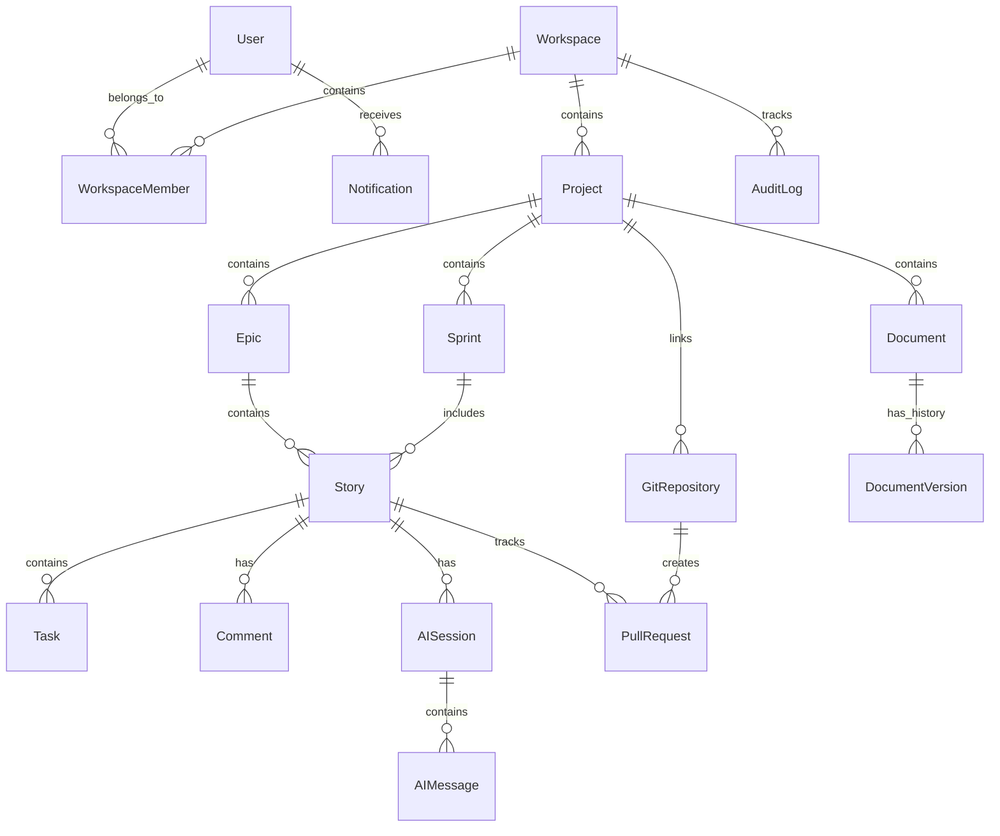

# Database Design
# DevPilot AI

**Version:** 1.0  
**Status:** Approved  

---

## 1. Introduction

### 1.1 Purpose
This Database Design document establishes the logical data architecture for DevPilot AI. It defines what data is persisted, how business entities relate to one another, and the structural rules governing multi-tenancy and data integrity. This document serves as the foundational blueprint for the subsequent Prisma schema implementation and database generation.

### 1.2 Scope
This document covers the logical data model for the Minimum Viable Product (MVP) of DevPilot AI. It defines the entities necessary to support the Core Modules (Authentication, Workspace, Project, Document, Story, AI, VCS Integration) and Supporting Modules (Notifications, Audit). It deliberately excludes implementation-specific artifacts such as physical SQL scripts or Prisma models.

### 1.3 Audience
- **Database Architects**: To validate the multi-tenancy and data integrity strategies.
- **Backend Engineers**: To implement the ORM models and data access repositories.
- **Data Engineers**: To understand the system's structural schema for future analytics.

### 1.4 References
- **Requirement.md**: Software Requirements Specification.
- **HLD.md**: High-Level Design.
- **LLD.md**: Low-Level Design.

---

## 2. Database Design Principles

### 2.1 Normalization Strategy
The database follows Third Normal Form (3NF) to minimize data redundancy and ensure logical data dependencies, which is critical for maintaining consistency in a highly relational, story-driven workflow system.

### 2.2 Referential Integrity
Strict referential integrity is enforced at the database level using foreign keys. The application layer must never be solely responsible for preventing orphaned records.

### 2.3 UUID Strategy
All entities utilize UUIDv4 (Universally Unique Identifiers) as their primary keys. This prevents predictable ID iteration (Insecure Direct Object Reference vulnerabilities) and facilitates future distributed data generation or offline creation.

### 2.4 Naming Conventions
At the logical level, all entities, attributes, and relationships adhere to standardized naming conventions (e.g., strictly defining foreign keys with the `_id` suffix logically, pending the exact naming convention mapped by the ORM).

### 2.5 Audit Fields
Every transactional business entity includes standard audit metadata: identifying who created and last modified the record, ensuring accountability.

### 2.6 Soft Delete Strategy
Records are not physically deleted from the database upon user action. Instead, they utilize a logical deletion strategy (soft delete) to preserve historical data relationships and allow for data recovery.

### 2.7 Timestamp Strategy
All temporal data and audit timestamps are strictly stored in Universal Time Coordinated (UTC). Timezone localization is exclusively the responsibility of the presentation layer.

---

## 3. Database Architecture

The logical database architecture is centralized within a single relational database (PostgreSQL), reflecting the Modular Monolith architectural pattern defined in the HLD. 

While the data resides in a unified persistence layer, it is logically partitioned across business domains. The architecture employs a **Pool-Based Multi-Tenancy** model, where all tenants (Workspaces) share the same database infrastructure, but tenant isolation is strictly enforced via a mandatory `workspace_id` discriminator on all tenant-scoped entities.

---

## 4. Business Entities

The system encompasses the following core business entities:

1. **User**: Represents a registered human identity.
2. **Workspace**: The primary multi-tenant isolation boundary.
3. **WorkspaceMember**: The junction entity mapping a User to a Workspace with a specific Role.
4. **Project**: A logical grouping of software assets within a Workspace.
5. **Document**: A technical or business knowledge artifact.
6. **DocumentVersion**: An immutable historical snapshot of a Document.
7. **Epic**: A large-scale software initiative.
8. **Sprint**: A time-boxed period in which work is completed.
9. **Story**: A discrete, actionable unit of work.
10. **Task**: A granular sub-component of a Story.
11. **Comment**: User or AI-generated discussion on work items.
12. **AISession**: A conversational context window between a User/Story and the AI Engine.
13. **AIMessage**: A single prompt or response within an AISession.
14. **GitRepository**: External source control metadata linked to a Project.
15. **PullRequest**: External code review metadata linked to a Story.
16. **Notification**: An alert dispatched to a specific User.
17. **AuditLog**: An immutable record of a state-mutating system event.

---

## 5. Entity Classification Matrix

| Entity | Module | Tenant Scoped | Soft Delete | Audit |
|---------|--------|---------------|-------------|-------|
| User | Authentication | No | Yes | Yes |
| Workspace | Workspace | Yes (Root) | Yes | Yes |
| WorkspaceMember | Workspace | Yes | Yes | Yes |
| Project | Project | Yes | Yes | Yes |
| Document | Document | Yes | Yes | Yes |
| DocumentVersion | Document | Yes | No | Yes |
| Epic | Story | Yes | Yes | Yes |
| Sprint | Story | Yes | Yes | Yes |
| Story | Story | Yes | Yes | Yes |
| Task | Story | Yes | Yes | Yes |
| Comment | Story | Yes | Yes | Yes |
| AISession | AI | Yes | Yes | Yes |
| AIMessage | AI | Yes | Yes | Yes |
| GitRepository | VCS Integration | Yes | Yes | Yes |
| PullRequest | VCS Integration | Yes | Yes | Yes |
| Notification | Notifications | Yes | Yes | No |
| AuditLog | Audit | Yes | No | No |

---

## 6. Entity Definitions

### 6.1 User
- **Purpose**: Represents an authenticated human interacting with the platform.
- **Primary Identifier**: User ID.
- **Relationships**: One-to-Many to WorkspaceMember, One-to-Many to Notification.
- **Ownership**: Global entity (not owned by a Workspace).
- **Lifecycle**: Created upon registration; logically deleted if the account is closed.
- **Business Constraints**: Email address must be globally unique.

### 6.2 Workspace
- **Purpose**: Provides tenant isolation for projects and users.
- **Primary Identifier**: Workspace ID.
- **Relationships**: One-to-Many to WorkspaceMember, Project, AuditLog.
- **Ownership**: Owned by the User who created it (Workspace Owner).
- **Lifecycle**: Created by a User; soft-deleted if the organization cancels their account.
- **Business Constraints**: Workspace slug/name must be globally unique.

### 6.3 WorkspaceMember
- **Purpose**: Maps users to workspaces and defines their RBAC permissions.
- **Primary Identifier**: Member ID.
- **Relationships**: Many-to-One to User, Many-to-One to Workspace.
- **Ownership**: Owned by the Workspace.
- **Business Constraints**: A User can only have one active role per Workspace.

### 6.4 Project
- **Purpose**: Groups related epics, stories, and repositories.
- **Primary Identifier**: Project ID.
- **Relationships**: Many-to-One to Workspace; One-to-Many to Epic, Sprint, Document, GitRepository.
- **Ownership**: Owned by the Workspace.
- **Business Constraints**: Project name must be unique within a Workspace.

### 6.5 Document
- **Purpose**: Stores foundational technical knowledge (PRD, HLD).
- **Primary Identifier**: Document ID.
- **Relationships**: Many-to-One to Project; One-to-Many to DocumentVersion.
- **Ownership**: Owned by the Project.
- **Lifecycle**: Actively mutated during planning; soft-deleted when deprecated.

### 6.6 DocumentVersion
- **Purpose**: Maintains an immutable history of document changes. Previous versions are immutable, existing versions are never overwritten, and every save operation creates a new version.
- **Primary Identifier**: Version ID.
- **Relationships**: Many-to-One to Document.
- **Ownership**: Owned by the Document.
- **Lifecycle**: Created automatically upon Document save; strictly immutable.

### 6.7 Epic
- **Purpose**: Groups large features.
- **Primary Identifier**: Epic ID.
- **Relationships**: Many-to-One to Project; One-to-Many to Story.
- **Ownership**: Owned by the Project.

### 6.8 Sprint
- **Purpose**: A time-boxed period for executing planned Stories.
- **Primary Identifier**: Sprint ID.
- **Relationships**: Many-to-One to Project; One-to-Many to Story.
- **Ownership**: Owned by the Project.
- **Lifecycle**: Created during planning; marked active, then closed upon completion.
- **Business Constraints**: Start and end dates cannot overlap with active sprints in the same Project.

### 6.9 Story
- **Purpose**: Represents an actionable unit of development.
- **Primary Identifier**: Story ID.
- **Relationships**: Many-to-One to Epic, Sprint; One-to-Many to Task, Comment, AISession, PullRequest.
- **Ownership**: Owned by the Epic (and transitively, the Project).
- **Business Constraints**: Must contain explicit Acceptance Criteria before transitioning out of the Backlog.

### 6.10 Task
- **Purpose**: Granular checklist items for a Story.
- **Primary Identifier**: Task ID.
- **Relationships**: Many-to-One to Story.
- **Ownership**: Owned by the Story.

### 6.11 Comment
- **Purpose**: Captures user or AI-generated discussion on work items.
- **Primary Identifier**: Comment ID.
- **Relationships**: Many-to-One to Story, Epic, User.
- **Ownership**: Owned by the Story or Epic.
- **Lifecycle**: Created by a User or AI; softly deleted if removed.
- **Business Constraints**: Cannot exist without a parent entity.

### 6.12 AISession
- **Purpose**: Represents the complete AI conversation context for code generation. No separate AIConversation entity is required.
- **Primary Identifier**: Session ID.
- **Relationships**: Many-to-One to Story, User; One-to-Many to AIMessage.
- **Ownership**: Owned by the Story.
- **Lifecycle**: Active during generation workflows; archived upon completion.

### 6.13 AIMessage
- **Purpose**: Represents an individual interaction (a discrete prompt or response string) within an AISession.
- **Primary Identifier**: Message ID.
- **Relationships**: Many-to-One to AISession.
- **Ownership**: Owned by the AISession.
- **Business Constraints**: Must be sequentially ordered within a Session.

### 6.14 GitRepository
- **Purpose**: Tracks external VCS linkage.
- **Primary Identifier**: Repository ID.
- **Relationships**: Many-to-One to Project; One-to-Many to PullRequest.
- **Ownership**: Owned by the Project.
- **Business Constraints**: An external repository can only be linked to one Project.

### 6.15 PullRequest
- **Purpose**: Tracks external code review status.
- **Primary Identifier**: PR ID.
- **Relationships**: Many-to-One to Story, GitRepository.
- **Ownership**: Owned by the Story.

### 6.16 Notification
- **Purpose**: An alert dispatched to a specific User.
- **Primary Identifier**: Notification ID.
- **Relationships**: Many-to-One to User.
- **Ownership**: Global to the User (but tenant-aware if generated within a Workspace).
- **Lifecycle**: Created on system events; deleted or archived after read.
- **Business Constraints**: Must be linked to a valid User.

### 6.17 AuditLog
- **Purpose**: Immutable compliance trail.
- **Primary Identifier**: Log ID.
- **Relationships**: Many-to-One to Workspace, User.
- **Ownership**: Owned by the Workspace.
- **Lifecycle**: Write-only; never modified or logically deleted.

---

## 7. Entity Relationships

### 7.1 Core Cardinality

- **User ↔ Workspace**: Many-to-Many (Resolved via `WorkspaceMember`).
- **Workspace ↔ Project**: One-to-Many.
- **Project ↔ Document**: One-to-Many.
- **Project ↔ Epic**: One-to-Many.
- **Project ↔ Sprint**: One-to-Many.
- **Epic ↔ Story**: One-to-Many.
- **Sprint ↔ Story**: One-to-Many.
- **Story ↔ Task**: One-to-Many.
- **Story ↔ Comment**: One-to-Many.
- **Story ↔ AISession**: One-to-Many.
- **AISession ↔ AIMessage**: One-to-Many.
- **Project ↔ GitRepository**: One-to-Many.
- **Story ↔ PullRequest**: One-to-One or One-to-Many (depending on PR strategy, logically One-to-Many for safety).

### 7.2 ASCII Relationship Diagram

```text
[User] 1-------* [WorkspaceMember] *-------1 [Workspace]
  |                                               |
  |                                               | 1
  |                                               |
  |                                               *
  |                                          [Project]
  |                                          /   |   \
  |                                        1/   1|   1\
  |                                        /     |     \
  |                                       *      *      *
  |                               [Document]  [Epic]  [GitRepository]
  |                                 |            |         |
  |                                1|           1|         |
  |                                 |            |         |
  |                                 *            *         |
  |                        [DocumentVersion]  [Story]      |
  |                                           /  |  \      |
  |                                         1/  1|  1\     |
  |                                         /    |    \    |
  |                                        *     *     *   |
  +---------------------------------[AISession] [Task] [PullRequest]
                                           |
                                          1|
                                           |
                                           *
                                      [AIMessage]
```

### 7.3 Mermaid ER Diagram



---

## 8. Multi-Tenancy Strategy

### 8.1 Workspace Isolation
The database strictly utilizes the **Workspace ID** as the tenant isolation key. Every business entity beneath a Workspace (e.g., Project, Epic, Story, Document) is logically bound to that Workspace ID, either directly or transitively through its parent.

### 8.2 Cross-Workspace Restrictions
Queries executed by the application layer must inherently append the tenant discriminator (`workspace_id = ?`) derived securely from the authenticated user's token/session. This guarantees that data cross-contamination is impossible at the database query level.

### 8.3 Ownership & Member Access
Users possess no implicit access to data. Access is granted exclusively through the `WorkspaceMember` junction entity, which dictates the user's role (Owner, Admin, Developer, Viewer) within that specific tenant boundary.

---

## 9. Data Integrity Rules

### 9.1 Required Relationships
Entities that cannot logically exist without a parent must enforce non-nullable foreign keys. For example, a `Story` must belong to an `Epic` (or at least a `Project`); it cannot be orphaned.

### 9.2 Cascade Rules
- **Restrict Deletion**: Critical business entities (e.g., Workspaces, Users) utilize `Restrict` rules. They cannot be hard-deleted if dependent records exist.
- **Cascade Deletion**: Tightly coupled, low-level entities (e.g., `AIMessage` belonging to an `AISession`, or `DocumentVersion` belonging to a `Document`) may utilize `Cascade` rules if the parent is hard-deleted (for GDPR compliance or test environment teardowns).

### 9.3 Business Constraints
Database-level constraints (e.g., `UNIQUE` indices) are heavily utilized to prevent race conditions that the application layer might miss, such as ensuring a User cannot be added to the same Workspace twice.

---

## 10. Indexing Strategy

To guarantee high performance at scale, the database employs a strategic indexing model:

- **Primary Keys**: Automatically indexed.
- **Foreign Keys**: All foreign keys (especially `workspace_id` and `project_id`) require secondary indexes, as they are the primary mechanisms for multi-tenant data retrieval and relational joins.
- **Searchable Text Fields**: High-velocity search targets (e.g., User Email, Workspace Slug, Project Name) require unique b-tree indexes.
- **State/Status Columns**: Columns frequently used in `WHERE` clauses for dashboard filtering (e.g., Story Status, PullRequest Status) require indexing to prevent full table scans.
- **Temporal Columns**: `created_at` and `updated_at` columns require indexes where time-series sorting is heavily utilized (e.g., AuditLogs, Notifications).

---

## 11. Audit Strategy

### 11.1 Standard Audit Metadata
Every table must include the following structural columns to satisfy basic tracking:
- `created_at`
- `updated_at`
- `created_by` (Foreign Key to User)
- `updated_by` (Foreign Key to User)

### 11.2 Immutable Audit Logs
For stringent compliance, the `AuditLog` entity acts as an append-only ledger. Any structural mutation (Workspace configuration change, User role elevation, Document deletion) triggers the creation of an AuditLog record detailing the actor, action, timestamp, and Structured change metadata of the delta.

---

## 12. Soft Delete Strategy

### 12.1 Logical Deletion
To prevent accidental data loss of critical engineering assets, entities utilize a Soft Delete pattern. This requires a `deleted_at` timestamp. If `deleted_at` is null, the record is active. If populated, the application layer excludes it from standard queries.

### 12.2 Recovery & Retention
Soft-deleted records can be easily recovered by nullifying the timestamp. A background database cleanup job (or application cron) will permanently purge (hard delete) soft-deleted records that exceed the organizational data retention policy (e.g., 90 days).

---

## 13. Security Considerations

### 13.1 Sensitive Data Encryption
Sensitive external configuration data (e.g., GitHub OAuth tokens, LLM API keys provided by tenants) must never be stored in plain text. They must be symmetrically encrypted at the application layer before being persisted to the database.

### 13.2 Password Storage
User passwords are never stored in plain text. They are stored as securely salted cryptographic hashes (e.g., secure one-way password hashing) directly in the database.

### 13.3 Data at Rest
The database infrastructure itself must utilize transparent data encryption (TDE) or block-level storage encryption to protect the physical database files at rest.

---

## 14. Performance Considerations

### 14.1 Pagination
Endpoints returning potentially unbounded datasets (e.g., Audit Logs, Notifications, AIMessages) must dictate database query strategies utilizing an efficient pagination strategy to maintain consistent query latency regardless of table depth.

### 14.2 Caching Strategy
Highly static, read-heavy data (e.g., Workspace Member Roles, global Project constraints) should be abstracted into a Distributed Caching Layer to relieve read pressure on the primary database engine.

### 14.3 Large Data Handling
Binary data, massive text blobs (e.g., generated system logs), and user avatars are intentionally excluded from the relational database. The database only stores metadata and URI pointers to the external Object Storage Service.

---

## 15. Future Scalability

The database schema is inherently designed for horizontal evolutionary growth. Because every core entity is strictly partitioned by `workspace_id`, the system is fully prepared for future database sharding. 

Should a single PostgreSQL instance hit theoretical vertical scaling limits, the database can be seamlessly sharded across multiple physical database instances by hashing the `workspace_id`, allowing the SaaS platform to scale infinitely without requiring a rewrite of the relational structure or the application's domain logic.
