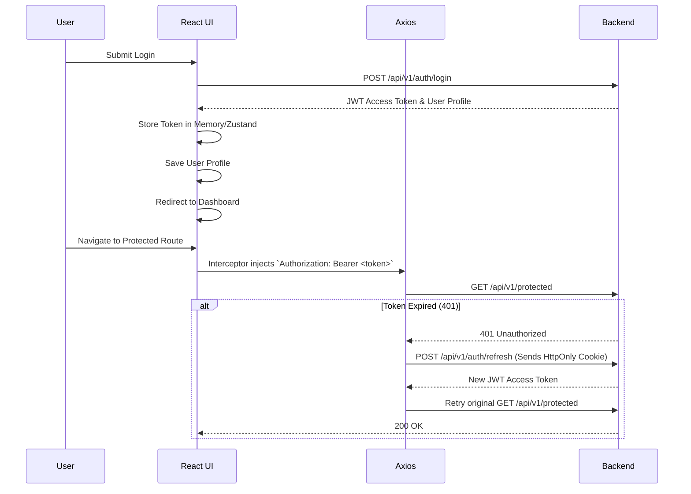

# DevPilot AI - Frontend Design Document

## 1. Introduction

### Purpose
This document defines the official Frontend Architecture & Design Blueprint for the DevPilot AI platform. It serves as the primary technical specification for frontend engineers, dictating application structure, state management, routing, and coding conventions.

### Scope
This design covers the client-side React application. It outlines the technology stack usage, component organization, API communication strategies, and UI/UX implementation patterns. It strictly excludes backend architecture, business logic implementation, and database schemas.

### Audience
Principal UI Architects, Frontend Developers, UI/UX Designers, and QA Engineers.

### References
- `Requirement.md`
- `HLD.md`
- `api-design.md`
- `development-roadmap.md`

---

## 2. Frontend Goals

- **Scalability:** The architecture must effortlessly support the continuous addition of new modules without degrading the developer experience or build times.
- **Maintainability:** Strict folder structures, coding standards, and separation of concerns ensure the codebase is easily understandable by new engineers.
- **Performance:** Optimized bundle sizes via Vite, aggressive code splitting, intelligent caching via TanStack Query, and virtualized lists guarantee a fast UI.
- **Reusability:** A centralized design system built on `shadcn/ui` ensures UI components are built once and reused globally.
- **Accessibility (a11y):** Full support for screen readers, keyboard navigation, and semantic HTML per WCAG 2.1 AA standards.
- **Responsive Design:** Mobile-first, fluid grid system powered by Tailwind CSS ensuring usability across all device breakpoints.
- **Security:** Robust prevention of XSS, secure JWT storage, and route-level authorization guards.
- **Developer Experience (DX):** Fast Hot Module Replacement (HMR), strong TypeScript typing, and linting enforce a frictionless development cycle.

---

## 3. Frontend Architecture

DevPilot AI utilizes a **Feature-Sliced Design (FSD)** inspired architecture, promoting high cohesion and low coupling.

- **Presentation Layer:** Dumb UI components responsible solely for rendering props and emitting events. Relies heavily on `shadcn/ui`.
- **Feature Layer:** Self-contained business modules (e.g., Stories, Sprints) containing their own components, hooks, and localized state.
- **State Layer:** Manages global application state (Zustand) and server state/caching (TanStack Query).
- **API Layer:** Abstracted HTTP client (Axios) handling interceptors, token injection, and endpoint mappings.
- **Shared Components:** Globally accessible, highly reusable components (Buttons, Inputs, Modals).
- **Shared Utilities:** Global helper functions, formatters, and Zod schemas.
- **Assets:** Static files (fonts, SVGs, images).
- **Configuration:** Environment variables, Vite config, and theme tokens.

---

## 4. Frontend Folder Structure

```text
src/
├── app/                  # Application root, global providers, and setup
├── assets/               # Static assets (images, fonts, global CSS)
├── components/           # Shared, highly reusable UI components (shadcn/ui)
├── config/               # Global configuration (env variables, constants)
├── features/             # Feature-based modules (Domain logic)
│   ├── auth/             # e.g., Authentication feature
│   ├── projects/         # e.g., Projects feature
│   └── stories/          # e.g., Stories feature
├── hooks/                # Global shared custom React hooks
├── layouts/              # Global layout wrappers (Dashboard, Auth, etc.)
├── lib/                  # Third-party library wrappers (Axios, Dayjs)
├── pages/                # Route-level page components (composed of features)
├── routes/               # Route configuration and guards
├── services/             # Global API endpoints (fallback for non-feature APIs)
├── stores/               # Global state stores (Zustand)
├── styles/               # Tailwind directives and global CSS
├── types/                # Global TypeScript declarations
└── utils/                # Pure utility functions and formatters
```

---

## 5. Routing Strategy

Routing is managed via **React Router**.

- **Public Routes:** Accessible without authentication (e.g., `/login`, `/register`, `/forgot-password`).
- **Protected Routes:** Requires a valid JWT. Unauthenticated users are redirected to `/login` via an `AuthGuard` component.
- **Role-Based Routes:** Access dictated by workspace RBAC. A `RoleGuard` component wraps specific routes to verify permissions.
- **Nested Routes:** Utilized heavily for hierarchical data (e.g., `/workspaces/:workspaceId/projects/:projectId/stories`).
- **Lazy Loaded Routes:** All route components are imported using `React.lazy()` and wrapped in `<Suspense>` to reduce initial bundle size.
- **Error Routes:** Fallback routes for `404 Not Found`, `403 Forbidden`, and generic runtime errors via React Router's error boundaries.
- **Route Guards:** High-order components (HOCs) that intercept routing attempts to perform auth/RBAC validation before rendering.

---

## 6. Layout Architecture

- **Authentication Layout:** Centered, minimal layout for login/registration forms. No navigation bars.
- **Workspace Layout:** Includes a global sidebar (Workspace selection, Settings) and top navigation.
- **Project Layout:** Nested within Workspace Layout. Adds a secondary sidebar specific to project modules (Stories, Sprints, Docs).
- **Settings Layout:** Two-column layout with a left-hand navigation menu for account and workspace settings.
- **Error Layout:** Full-screen layout for displaying 404, 403, and 500 errors with clear return actions.

---

## 7. Authentication & Authorization Flow



- **RBAC on UI:** UI elements (e.g., "Delete Project" button) are hidden or disabled based on the user's role in the current workspace using a custom `usePermissions` hook.
- **Workspace Switching:** Changing workspaces triggers a re-fetch of the workspace role and invalidates relevant TanStack Query caches.

---

## 8. State Management Strategy

Strict segregation of state types to prevent "prop drilling" and bloated global stores.

- **Server State (TanStack Query):** Primary state mechanism. Handles caching, background updates, pagination, and invalidation for all API data.
- **Global State (Zustand):** Used sparingly for pure UI global state (e.g., Theme, Sidebar collapsed state, currently active Workspace ID, Auth State).
- **Local State (React `useState` / `useReducer`):** Used for isolated component state (e.g., dropdown open/close, local form inputs).
- **Persistent State:** Handled via Zustand middleware (`persist`) bridging to `localStorage` for user preferences (Theme, Sidebar state).
- **UI State:** Transient state managed locally within the component tree or via URL query parameters for shareable states (e.g., current active tab, search filters).

---

## 9. API Communication

Centralized through a highly configured **Axios Instance** (`src/lib/axios.ts`).

- **Request Interceptors:** Automatically inject the `Authorization` header with the active JWT. Handle request tracing headers.
- **Response Interceptors:** Normalize backend error responses into a consistent format. Catch `401` errors to trigger the token refresh flow.
- **Error Handling:** Global error boundary catches unexpected failures; localized API errors are returned to the caller for specific UI handling.
- **Retry Strategy:** Handled by TanStack Query. Failed GET requests are retried automatically with exponential backoff (e.g., 3 retries). Mutations (POST/PUT/DELETE) are never retried automatically.
- **Caching:** Defined per endpoint via TanStack Query. Static data cached heavily; dynamic data invalidated aggressively upon mutations.
- **Loading States:** Derived directly from TanStack Query's `isLoading` and `isPending` properties.

---

## 10. Component Architecture

- **Pages:** Route-level components. Responsible for mapping URL params, initiating data fetching (via hooks), and composing layouts and feature components.
- **Layouts:** Structural wrappers maintaining consistent UI frames.
- **Feature Components:** Domain-specific components located in `src/features/*`. They encapsulate their own UI, hooks, and local state (e.g., `StoryBoard`, `CreateSprintModal`).
- **Shared Components:** General-purpose, context-agnostic UI elements (e.g., `Button`, `DataTable`). Extracted from `shadcn/ui` into `src/components/ui`.
- **Reusable Components:** Composed shared components mapping to specific platform patterns (e.g., `UserAvatar`, `WorkspaceSelector`).

---

## 11. Feature Module Structure

Every core module follows an FSD-inspired structure within `src/features/`.

### Example Module: Stories (`src/features/stories/`)
- `components/`
  - `StoryCard.tsx`
  - `StoryBoard.tsx`
  - `CreateStoryForm.tsx`
- `hooks/`
  - `useStories.ts` (TanStack Query `useQuery`)
  - `useCreateStory.ts` (TanStack Query `useMutation`)
- `routes/`
  - `StoryRoutes.tsx`
- `types/`
  - `story.types.ts`
- `utils/`
  - `storyFilters.ts`

**Core Modules Required:**
- Authentication
- Workspace
- Projects
- Documentation
- Stories
- Sprints
- AI Workspace
- GitHub
- Notifications
- Activity
- Settings

---

## 12. Forms Strategy

- **Core Library:** `react-hook-form` for performant, uncontrolled input management.
- **Validation:** `zod` schema validation integrated directly with react-hook-form via `@hookform/resolvers/zod`.
- **Reusable Form Components:** A generic `<Form>` component wrapping `shadcn/ui` inputs to handle accessibility, label association, and error message rendering automatically.
- **Submission Flow:**
  1. Zod schema validates synchronously on submit.
  2. If valid, TanStack Query `mutateAsync` is called.
  3. UI enters loading state (disabling submit button).
  4. On success, cache invalidated, toast success message shown, form reset/modal closed.
  5. On failure, server errors mapped to specific fields if applicable, or generic error toast shown.

---

## 13. Design System

Powered by **Tailwind CSS** and **shadcn/ui**. Components are un-styled headless primitives wrapped with Tailwind utility classes, allowing full customization.

**Core Components:**
- **Buttons:** Primary, Secondary, Outline, Ghost, Destructive. Support icons and loading spinners.
- **Inputs:** Text, Textarea, Password (with toggle), Select, Date Picker. All support error states.
- **Tables:** Advanced `DataTable` supporting sorting, filtering, and pagination (using `@tanstack/react-table`).
- **Cards:** Used heavily for dashboard widgets, story details, and settings panels.
- **Dialogs/Modals:** Accessible overlays for creation flows (e.g., Create Project).
- **Badges:** Status indicators (e.g., `IN_PROGRESS`, `HIGH_PRIORITY`).
- **Navigation:** Top app bar, collapsible sidebars.
- **Tabs:** Used for sub-navigation within entity detail pages.
- **Empty States:** Standardized illustrations and copy for list views with zero records.

---

## 14. Theme & Styling

- **Tailwind CSS:** Primary styling engine. No traditional `.css` files (except global resets).
- **Color Tokens:** Semantic variables defined in `tailwind.config.js` mapping to CSS variables (e.g., `bg-primary`, `text-muted`).
- **Dark Mode:** Native support via Tailwind's `dark:` modifier. Controlled by a global theme provider (Zustand) toggling a `dark` class on the `<html>` element.
- **Typography:** Modern sans-serif stack (e.g., `Inter` or `Geist`). Defined globally in Tailwind config.
- **Spacing:** Strict adherence to Tailwind's default spacing scale (4px increments) to ensure vertical and horizontal rhythm.

---

## 15. Error Handling Strategy

- **401 Unauthorized:** Axios interceptor catches, attempts refresh. If refresh fails, user is logged out and redirected to `/login`.
- **403 Forbidden:** Renders a generic "Access Denied" fallback UI via React Router Error Boundary.
- **404 Not Found:** Renders a "Page Not Found" layout.
- **500 Server Error:** Renders a "Something went wrong" fallback UI. Prompts user to retry or contact support.
- **Validation Errors (400/422):** API payload validation errors are mapped directly to `react-hook-form` fields for inline display.
- **Network Errors:** Displays a generic "Network error, please check your connection" toast message.

---

## 16. Loading Strategy

- **Skeleton Screens:** Preferred over spinners for initial page loads and large data structures (e.g., `TableSkeleton`, `StoryBoardSkeleton`).
- **Spinners:** Used for localized, small footprint loading (e.g., inside a button during submission).
- **Lazy Loading:** Route changes utilizing `React.lazy` display a top-level progress bar (e.g., `nprogress`) while JS bundles download.

---

## 17. Notification Strategy

Global toast notifications utilizing `sonner` or `react-hot-toast`.

- **Success Messages:** Non-intrusive, auto-dismissing (e.g., "Story created successfully").
- **Error Messages:** Prominent, requires manual dismissal for critical errors, auto-dismissing for minor issues.
- **Warning Messages:** Used for non-destructive alerts.
- **Confirmation Dialogs:** Modal dialogs requiring explicit user input before executing destructive actions (e.g., "Are you sure you want to delete this project?").

---

## 18. Performance Optimization

- **Code Splitting:** Route-level chunking via Vite and `React.lazy`.
- **Memoization:** Strategic use of `React.memo`, `useMemo`, and `useCallback` exclusively for expensive calculations or preventing unnecessary re-renders in large lists (e.g., Kanban boards).
- **Virtualized Lists:** Implementing `@tanstack/react-virtual` for long lists (e.g., Activity Feeds, massive backlogs) to ensure stable 60fps rendering.
- **Image Optimization:** SVG preferred for all icons. Any raster images lazily loaded.
- **Bundle Optimization:** `import type` enforced in TypeScript to ensure types are stripped from the final bundle. Use of barrel files (`index.ts`) optimized to prevent pulling in unused code.

---

## 19. Accessibility (a11y)

- **Radix UI Primitives:** Since `shadcn/ui` utilizes Radix under the hood, ARIA attributes, focus trapping, and keyboard navigation are baked into complex components (Modals, Selects, Dropdowns).
- **Keyboard Navigation:** Full support for `Tab` indexing and `Enter/Space` activation on all interactive elements.
- **Color Contrast:** All theme colors audited to pass WCAG AA contrast ratios.
- **Semantic HTML:** Proper use of `<nav>`, `<main>`, `<article>`, `<button>` (never `onClick` on a `<div>`).

---

## 20. Security

- **JWT Storage:** Access tokens stored in memory/Zustand. Refresh tokens strictly stored in `HttpOnly`, `Secure`, `SameSite=Strict` cookies handled by the backend.
- **XSS Prevention:** React natively escapes string variables. Strict rules against `dangerouslySetInnerHTML` unless parsing trusted Markdown (utilizing robust sanitizers like `DOMPurify`).
- **Role-Based Rendering:** UI elements tied to permissions are conditionally rendered, but this is UX only—backend remains the ultimate source of truth for authorization.
- **Sensitive Data:** Avoid logging sensitive data (tokens, PII) to the console.

---

## 21. Frontend Testing Strategy

- **Unit Testing:** `Vitest` and `React Testing Library`. Focused on testing pure utility functions, Zod schemas, and complex custom hooks.
- **Component Testing:** Testing isolated, complex UI components (e.g., complex form validations) utilizing mocked TanStack Query providers.
- **Integration Testing:** Testing feature flows (e.g., Story Creation) by mocking Axios responses via `msw` (Mock Service Worker).
- **End-to-End (E2E) Testing:** `Playwright` utilized for critical user journeys (Login, Workspace Creation, Core AI Generation flow) running against a staging environment.

---

## 22. Coding Standards

- **Folder Naming:** `kebab-case` (e.g., `workspace-settings`).
- **File Naming:** `PascalCase.tsx` for React components. `camelCase.ts` for utilities, hooks, and configs.
- **Component Naming:** `PascalCase`, matching the filename exactly.
- **Hook Naming:** Prefixed with `use` (e.g., `useWorkspaceRole`).
- **Type Naming:** `PascalCase`. Interfaces preferred over type aliases for objects. Exclude the `I` prefix (e.g., `User`, not `IUser`).
- **Import Order:** Enforced via `eslint-plugin-simple-import-sort`. External libraries first, absolute internal aliases (`@/components`), then relative imports.

---

## 23. Frontend Development Workflow

- **Branch Strategy:** Feature branching off `main`. Branch naming convention: `feat/ticket-id-description`, `fix/ticket-id-description`.
- **Pull Requests:** Require at least one peer approval. CI pipeline must pass (Lint, TS Check, Unit Tests).
- **Linting & Formatting:** Enforced via `ESLint` and `Prettier` on pre-commit hooks (`husky` + `lint-staged`).
- **Deployment:** Managed via Vercel or standard CDN pipeline. Merges to `main` auto-deploy to Staging; releases are tagged for Production deployment.
