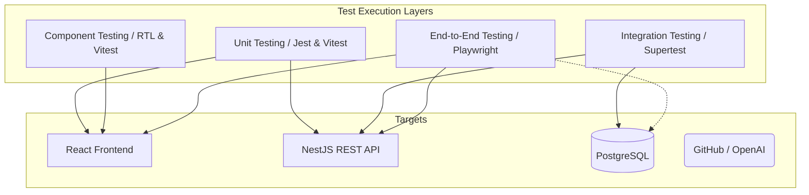

# DevPilot AI - Testing Strategy

## 1. Introduction

### Purpose
This document serves as the official Quality Assurance (QA) and Testing Strategy for the DevPilot AI platform. It outlines the comprehensive approach to ensuring quality across the entire Software Development Lifecycle (SDLC).

### Scope
This strategy covers all testing activities for the DevPilot AI Monorepo, including the React frontend, NestJS backend, PostgreSQL database, external integrations (GitHub, LLMs), and CI/CD quality gates. 

### Audience
QA Engineers, Software Development Engineers in Test (SDETs), Frontend Developers, Backend Developers, DevOps Engineers, and Engineering Managers.

### References
- `Requirement.md`
- `HLD.md` & `LLD.md`
- `database-design.md`
- `api-design.md`
- `frontend-design.md` & `backend-design.md`

---

## 2. Testing Goals

- **Quality:** Ensure all features adhere strictly to documented business requirements and design specifications.
- **Reliability:** Guarantee system availability and correct behavior under standard and edge-case conditions.
- **Maintainability:** Ensure test code is as clean, modular, and reviewable as production code.
- **Performance:** Verify that the system meets latency and throughput SLAs, especially for AI generation and large workspace loads.
- **Security:** Identify and mitigate vulnerabilities (OWASP Top 10) to protect tenant data and isolate workspaces.
- **Stability:** Prevent brittle tests; minimize flaky test occurrences through proper isolation and mocking.
- **Regression Prevention:** Catch breaking changes automatically via CI/CD before they reach staging or production.

---

## 3. Testing Principles

- **Shift Left Testing:** Integrate testing early in the SDLC. QA participates in requirement and design reviews to identify defects before code is written.
- **Continuous Testing:** Automated tests execute continuously triggered by PRs and commits.
- **Risk-Based Testing:** Prioritize test coverage and execution depth based on the module's business criticality and risk profile (e.g., Auth and AI Generation are highest priority).
- **Automation First:** Manual testing is reserved for exploratory testing, UX validation, and edge-case scenarios that are too costly to automate. All repetitive tests must be automated.
- **Test Pyramid:** Maintain a high volume of fast, reliable Unit Tests, a moderate amount of Integration Tests, and a focused, smaller set of End-to-End (E2E) tests.
- **Early Feedback:** Fast test execution ensures developers receive immediate feedback on their local machines and in PR checks.
- **Quality Gates:** Code cannot be merged or deployed unless it passes predefined, automated quality thresholds.

---

## 4. Testing Architecture

- **Frontend Testing:** Handled by Vitest (logic) and React Testing Library (DOM/Components).
- **Backend Testing:** Handled by Jest.
- **API Testing:** Handled by Supertest against the NestJS app.
- **Database Testing:** Validated via backend integration tests using isolated test databases (Testcontainers or transaction rollbacks).
- **Integration Testing:** Tests module interaction, bypassing external HTTP calls via mocking.
- **End-to-End Testing:** Handled by Playwright, driving the real browser against a fully deployed staging/QA environment.
- **Manual Testing:** Exploratory testing for complex UX/UI behaviors.
- **Automation Testing:** The foundation of the strategy, driven via GitHub Actions.

---

## 5. Testing Levels

- **Unit Testing:** Validates isolated functions, classes, and hooks. External dependencies are fully mocked.
- **Component Testing:** Renders UI components in isolation to verify props, state, and user interactions.
- **Integration Testing:** Verifies the interaction between multiple units (e.g., Controller + Service + Repository) connected to a real database but mocking external APIs.
- **System Testing:** Validates the fully integrated application as a whole against the requirements.
- **End-to-End Testing:** Simulates real user scenarios from the browser, hitting real APIs and databases to validate full-stack workflows.
- **Regression Testing:** Automated suite run before releases to ensure new code hasn't broken existing functionality.
- **Smoke Testing:** A tiny, fast subset of E2E tests run post-deployment to verify critical paths (e.g., Login, App Load) are functional.
- **Sanity Testing:** Focused testing on a specific component after a bug fix.
- **Acceptance Testing:** User Acceptance Testing (UAT) performed by Product Managers against Acceptance Criteria.

---

## 6. Frontend Testing Strategy

- **UI Components:** Tested with React Testing Library (RTL). Focus on accessibility roles and user-centric queries (e.g., `getByRole`, `getByText`) rather than implementation details.
- **Forms:** Validate form schemas (Zod), submission states, validation error rendering, and successful payload generation.
- **Routing:** Mock React Router to ensure protected routes redirect to login, and valid routes mount the correct page components.
- **State Management:** Test Zustand stores and custom hooks in isolation. Mock TanStack Query hooks for component testing.
- **Authentication:** Test login form logic, token storage, and logout clearance.
- **Protected Routes:** Ensure unauthorized users are redirected.
- **Responsive UI:** Playwright E2E tests will run against defined mobile, tablet, and desktop viewports.
- **Accessibility:** Integrate `jest-axe` to automatically flag WCAG violations during component tests.

---

## 7. Backend Testing Strategy

- **Controllers:** Minimal testing to ensure correct HTTP routing, payload transformation, and status codes. Business logic is mocked.
- **Services:** Heavy unit testing. Focus on business logic, conditional branching, and domain events. Repositories and external integrations are mocked.
- **Repositories:** Integration tests running against a real PostgreSQL database (using Testcontainers or a dedicated test DB). Ensure transactions and complex queries work.
- **Authentication:** Validate JWT signing, expiration handling, and refresh token rotation.
- **Authorization:** Unit test RoleGuards to ensure RBAC and tenant isolation (`workspaceId` enforcement) are strictly applied.
- **Validation:** Ensure DTOs reject malformed payloads using `class-validator` test cases.
- **Exception Handling:** Verify custom exceptions correctly map to HTTP standard errors.
- **Background Jobs:** Test BullMQ job producers and consumers in isolation, verifying retry logic and failure states.

---

## 8. API Testing Strategy

- **CRUD APIs:** Validate standard Create, Read, Update, Delete flows, verifying database state changes.
- **Authentication APIs:** Test valid/invalid credentials, token generation, and token rejection.
- **Authorization:** Test every endpoint with tokens from different roles (Owner, Admin, Developer, Viewer) to ensure proper 403 Forbidden responses.
- **Pagination:** Validate `page`, `limit`, and `totalRecords` calculations.
- **Filtering & Sorting:** Test query parameters and their resulting database queries.
- **Validation:** Send malformed JSON and verify `400 Bad Request` with structured error messages.
- **Error Responses:** Ensure standard error formats and metadata (trace IDs) are consistently returned.
- **Rate Limiting:** Send burst requests and assert `429 Too Many Requests` responses.

---

## 9. Database Testing

- **CRUD:** Validate that repositories correctly map entities to database rows.
- **Relationships:** Ensure cascading deletes and foreign key relationships operate correctly (e.g., deleting a Project deletes its Stories).
- **Constraints:** Force unique constraint violations and nullability errors to ensure the DB rejects invalid state.
- **Transactions:** Test transaction rollbacks by intentionally failing a multi-step service method.
- **Indexes:** Ensure queries utilize indexes via EXPLAIN checks during performance testing.
- **Tenant Isolation:** Crucial security tests. Attempt to fetch Workspace B's data using Workspace A's context. Must fail.
- **Soft Deletes:** Ensure soft-deleted records do not appear in standard queries but are retained in the database.

---

## 10. AI Testing Strategy

- **Prompt Validation:** Ensure system prompts are injected securely without exposing internal backend structures.
- **Response Validation:** Use schema validation (Zod) on the output of LLM responses to ensure it matches expected formats (JSON/Markdown).
- **Streaming Responses:** Test SSE (Server-Sent Events) for chunks delivery and graceful closure.
- **Token Tracking:** Verify prompt and completion tokens are correctly logged to the database.
- **Timeout Handling:** Force API delays to verify the backend gracefully handles LLM timeouts and alerts the user.
- **Fallback Handling:** Test logic for when an LLM provider returns a 500 or rate limit.
- **Prompt Injection Testing:** Attempt to override the system prompt with malicious user input to ensure the AI does not leak data or break character.
- **LLM Failure Scenarios:** Assert the application remains stable even if AI generation features are completely offline.

---

## 11. GitHub Integration Testing

- **OAuth:** Mock the OAuth callback to ensure access tokens are securely exchanged and encrypted.
- **Repository Connection:** Test linking and unlinking repositories to workspaces.
- **Webhook Validation:** Send fake webhook payloads with invalid HMAC signatures. Must be rejected.
- **Commit Sync:** Send valid webhook payloads and verify commit hashes are linked to matching user stories.
- **Pull Request Sync:** Validate PR status changes (Open -> Merged) update the respective story status.
- **Failure Recovery:** Simulate a failed webhook delivery and ensure the manual "Sync" endpoint accurately reconciles state.

---

## 12. Security Testing

- **Authentication:** Test password complexity, lockout mechanisms, and secure cookie attributes.
- **Authorization:** Aggressive testing of the RBAC matrix.
- **JWT:** Attempt to use expired, tampered, or improperly signed tokens.
- **Tenant Isolation:** Penetration testing to ensure lateral movement between workspaces is impossible.
- **XSS:** Attempt to inject scripts into markdown editors, story titles, and user profiles. Ensure React/DOMPurify sanitizes them.
- **CSRF:** Ensure API relies on Authorization headers, mitigating standard cookie-based CSRF vectors.
- **SQL Injection:** Relies on Prisma ORM, but tests will intentionally inject SQL control characters to ensure safe parameterized querying.
- **Rate Limiting:** Validate throttler guards protect public endpoints.
- **OWASP Top 10:** General adherence and automated scanning via tools like Snyk or SonarQube.

---

## 13. Performance Testing

- **Load Testing:** Simulate 500 concurrent users performing standard operations (viewing boards, updating stories) via `k6`.
- **Stress Testing:** Push the system beyond defined limits to observe failure modes and ensure graceful degradation.
- **Spike Testing:** Simulate sudden bursts of traffic (e.g., a massive influx of GitHub webhooks).
- **Soak Testing:** Run moderate load over 24 hours to identify memory leaks in Node.js.
- **API Latency:** Ensure 95th percentile (p95) response times are < 250ms for core endpoints.
- **Database Performance:** Identify N+1 query problems and ensure slow queries (> 500ms) are logged and optimized.
- **Concurrent Users:** Test WebSocket/collaboration stability with multiple users editing the same document.

---

## 14. Accessibility Testing

- **WCAG:** Target WCAG 2.1 AA compliance.
- **Keyboard Navigation:** Ensure all critical flows (create story, start sprint) can be completed without a mouse.
- **Screen Readers:** Ensure aria-labels, alt text, and semantic HTML are utilized.
- **Color Contrast:** Automated testing to verify text meets minimum contrast ratios.
- **Responsive Testing:** Ensure UI remains usable at 320px width without breaking layouts or overlapping elements.

---

## 15. Compatibility Testing

- **Browsers:** Chrome (latest), Firefox (latest), Safari (latest), Edge (latest).
- **Desktop:** Windows, macOS, Linux (via browser compatibility).
- **Mobile:** iOS Safari, Android Chrome (Responsive Web UI testing).
- **Tablet:** iPad, standard Android tablets.
- **Operating Systems:** Handled inherently by cross-browser testing.

---

## 16. Test Data Strategy

- **Seed Data:** A standardized database seed script is provided for local development and QA environments to establish a known state (Workspaces, Users, Roles).
- **Mock Data:** Unit and component tests rely heavily on factories (e.g., `faker.js`) to generate dynamic mock data.
- **Synthetic Data:** Large volume data scripts used exclusively for performance testing.
- **Isolation:** Each E2E test suite execution should create its own temporary Workspace or Tenant to avoid cross-test data pollution.
- **Cleanup:** Tests must reliably clean up database state after execution using `beforeEach` / `afterEach` hooks or transaction rollbacks.

---

## 17. Test Environment Strategy

- **Local:** Developer machines. Runs Unit, Component, and local Integration tests backed by Dockerized Postgres.
- **Development:** Merges to `dev` branch. Continuous deployment environment for backend and frontend integration.
- **QA:** Stable environment matching staging. Used by QA engineers for exploratory testing and manual validation of complex features.
- **Staging:** Production replica. Runs the full E2E test suite. Used for final sign-off and load testing.
- **Production Validation:** Smoke tests executed immediately post-deployment against live infrastructure using safe "test tenant" accounts.

---

## 18. Defect Management

- **Bug Lifecycle:** New -> Triage -> In Progress -> In QA -> Resolved -> Closed.
- **Severity:** 
  - *Critical* (System down, data loss)
  - *High* (Major feature broken, no workaround)
  - *Medium* (Feature impaired, workaround exists)
  - *Low* (UI glitch, minor annoyance)
- **Priority:** P0 (Immediate), P1 (Next deployment), P2 (Current Sprint), P3 (Backlog).
- **Root Cause Analysis (RCA):** Required for all Critical and High production defects.
- **Regression Verification:** Any resolved bug MUST include an automated test preventing its recurrence before the ticket is closed.

---

## 19. Test Automation Strategy

- **Automation Scope:** All CRUD operations, RBAC rules, calculations, and critical user journeys.
- **Automation Pyramid:** 70% Unit/Component, 20% Integration, 10% E2E.
- **Execution Frequency:** Unit/Integration on every commit. E2E on PR merge to `main` and nightly builds.
- **CI Integration:** GitHub Actions blocks PRs if tests fail.
- **Flaky Test Handling:** Tests that fail intermittently will be quarantined, marked as skipped, and a P1 ticket created to fix them. Flaky tests cannot block CI but must be resolved.

---

## 20. CI/CD Quality Gates

For a Pull Request to be merged, it must pass the following automated gates:

1. **Lint:** `eslint` and `prettier` execution.
2. **Type Check:** `tsc --noEmit` must pass with zero errors.
3. **Unit Tests:** 100% pass rate.
4. **Integration Tests:** 100% pass rate.
5. **Coverage:** Fails if overall coverage drops below the required threshold.
6. **Build Validation:** Application bundles successfully via Vite/Nest CLI.
7. **Security Scan:** `npm audit` or `snyk` scan showing zero Critical/High vulnerabilities.

---

## 21. Test Coverage Goals

- **Frontend:** > 75% Statement coverage. Focus heavily on custom hooks and complex UI logic (Kanban).
- **Backend:** > 85% Statement coverage.
- **API:** 100% of endpoints covered by at least one integration test (Positive and Negative).
- **Critical Modules (Auth, RBAC):** > 95% branch coverage.
- **AI:** > 80% coverage on internal processing logic; external API logic heavily mocked.
- **GitHub Integration:** > 90% coverage on webhook parsing and HMAC validation.

---

## 22. Module-wise Testing Strategy

### 1. Authentication
- **Scope:** Login, Registration, JWT issuing, Password Reset.
- **Positive:** Successful login, successful refresh.
- **Negative:** Invalid password, unregistered email, expired token.
- **Security:** Brute force lockout, JWT signature manipulation.

### 2. Workspace
- **Scope:** Tenant isolation, invitations, settings.
- **Positive:** Accept invite, edit workspace.
- **Negative:** Accessing another workspace's data, inviting invalid emails.
- **Security:** Ensure users only see workspaces they are members of.

### 3. Projects
- **Scope:** Project CRUD.
- **Positive:** Create project, archive project.
- **Negative:** Duplicate project keys.
- **Edge:** Archiving a project with active sprints.

### 4. Documentation
- **Scope:** Markdown editing, publishing.
- **Positive:** Save draft, publish document.
- **Negative:** Empty document titles.
- **Security:** XSS payloads within markdown.

### 5. Stories
- **Scope:** Backlog items, assignments, status changes.
- **Positive:** Create story, move across Kanban board.
- **Negative:** Invalid points, assigning to non-workspace members.
- **Performance:** Rendering boards with >1000 stories.

### 6. Sprints
- **Scope:** Sprint lifecycles.
- **Positive:** Start sprint, complete sprint.
- **Negative:** Starting two sprints simultaneously in one project.
- **Edge:** Completing a sprint with unfinished stories (must rollover).

### 7. AI Workspace
- **Scope:** Prompt injection, generation parsing.
- **Positive:** Successful JSON parse of LLM output.
- **Negative:** LLM timeout, LLM returns invalid JSON.
- **Security:** Prompt injection attacks trying to override system instructions.

### 8. GitHub Integration
- **Scope:** Webhooks, linking.
- **Positive:** Valid webhook updates story to "In Progress".
- **Negative:** Invalid HMAC signature is rejected.
- **Edge:** GitHub sends duplicate webhooks.

### 9. Notifications
- **Scope:** Event listening, dispatching.
- **Positive:** Notification created on story assignment.
- **Negative:** User opts out, ensure no email is sent.

### 10. Activity
- **Scope:** Audit logging.
- **Positive:** Changing a role creates an audit log.
- **Security:** Ensure audit logs cannot be modified or deleted via API.

### 11. Settings
- **Scope:** Global configurations.
- **Positive:** Update theme, update profile.
- **Authorization:** Only Admins can view billing settings.

---

## 23. Risk-Based Testing

| Risk Area | Risk Level | Description | Mitigation Strategy |
| :--- | :--- | :--- | :--- |
| **Tenant Data Leakage** | High | User sees data from another workspace. | Strict unit tests on `RoleGuard`. DB integration tests explicitly validating `workspaceId` filters. |
| **AI Cost Overruns** | High | Infinite loops hitting LLM APIs. | Aggressive rate limiting. Strict Unit tests on retry logic. Cost alerting. |
| **Authentication Bypass**| High | Tampered JWTs granting access. | Validate token signatures. Security scans. |
| **Kanban Performance** | Medium | Board lags with many stories. | Load test with 5000+ stories. Enforce virtualized lists in UI tests. |
| **GitHub Sync Failure** | Low | Webhook missed, data out of sync. | Build and test manual sync fallback endpoints. |

---

## 24. Quality Metrics

- **Test Coverage:** Target >80% overall line coverage.
- **Pass Rate:** E2E and Integration suites must maintain a >98% pass rate in CI.
- **Defect Density:** Track bugs per 1k lines of code. Target < 2.
- **Bug Leakage:** Measure percentage of bugs found in Production vs QA. Target < 5%.
- **Mean Time to Detect (MTTD):** Target < 1 hour for production monitoring.
- **Mean Time to Resolve (MTTR):** Target < 24 hours for Critical bugs.
- **Automation Coverage:** >90% of repeatable test cases automated.
- **Build Success Rate:** CI pipeline success > 90%.

---

## 25. Release Validation Checklist

Before any production release, the following checklist MUST be fulfilled:

- [ ] **Functional Testing:** All new feature acceptance criteria verified.
- [ ] **Regression:** Automated E2E test suite passes 100%. No new flaky tests introduced.
- [ ] **Performance:** `k6` load tests run successfully against staging. No API degradation.
- [ ] **Security:** Snyk/SonarQube scans pass. No exposed secrets.
- [ ] **Database:** Prisma migration scripts tested on staging data copy successfully.
- [ ] **API:** OpenAPI/Swagger definitions updated and match implementation.
- [ ] **Frontend:** Verified across Chrome, Safari, and Edge. Responsive views intact.
- [ ] **Backend:** All unit and integration tests passing.
- [ ] **AI:** Prompt templates verified. Token tracking functioning.
- [ ] **GitHub Integration:** Webhooks tested with live GitHub repository in staging.
- [ ] **Documentation:** `CHANGELOG.md` updated. Release notes finalized.
